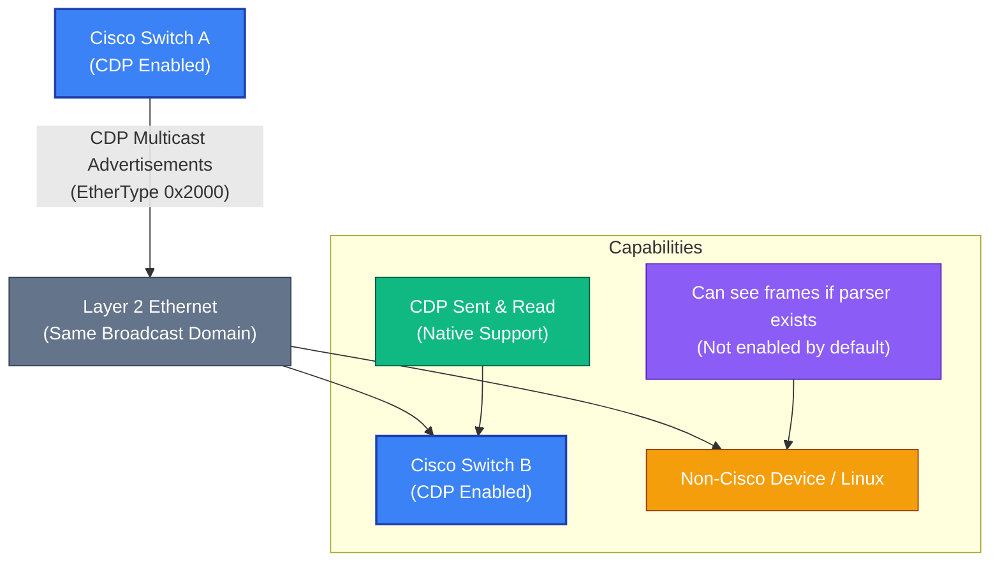

# Can Non-Cisco Devices Read or Transmit CDP?

## Overview
Cisco Discovery Protocol (CDP) is commonly used in Cisco networks to advertise information about directly connected devices, such as platform type, software version, and IP addressing. While CDP is often described as a _Cisco-only_ protocol, this raises an important question: **is CDP restricted by design, or simply by vendor implementation and operational practice?**

If a non-Cisco device or a Linux system is technically capable of decoding Ethernet frames, can it read CDP advertisements or even transmit CDP frames that Cisco devices accept? If so, does this present a security concern given the amount of information CDP exposes at Layer 2? And if not, what exactly prevents non-Cisco devices from participating—protocol mechanics, Cisco-specific enforcement, or lack of native support?

This post explores CDP from a protocol and security perspective to understand whether its safety relies on technical controls, vendor boundaries, or best-practice configuration such as disabling CDP on untrusted interfaces.

### Scenario

