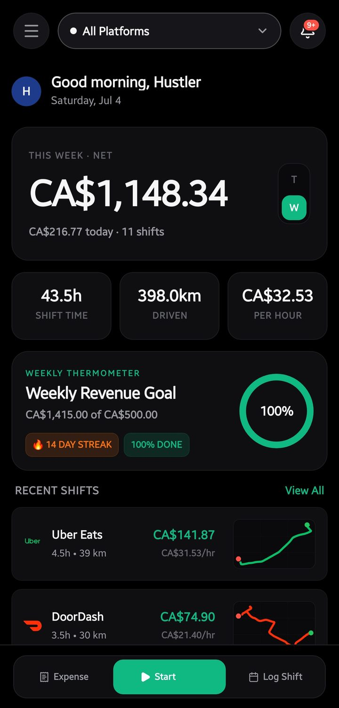
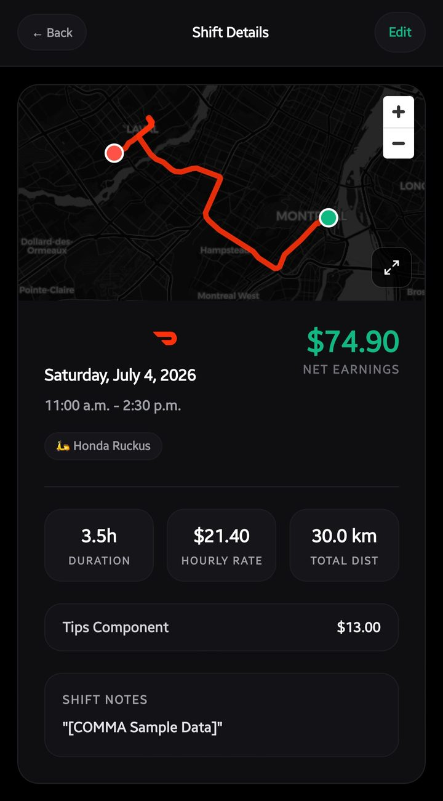
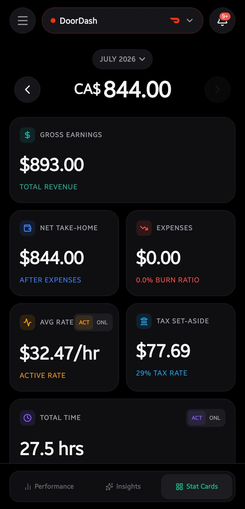
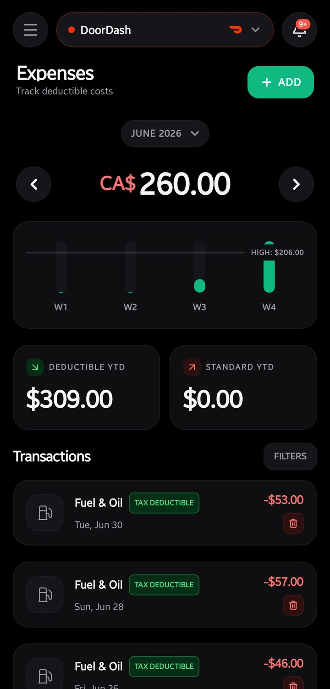
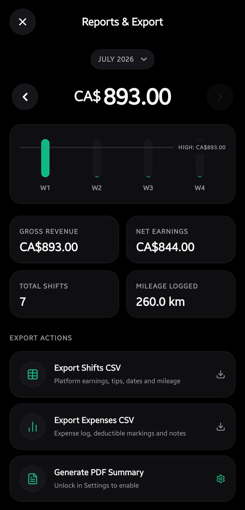
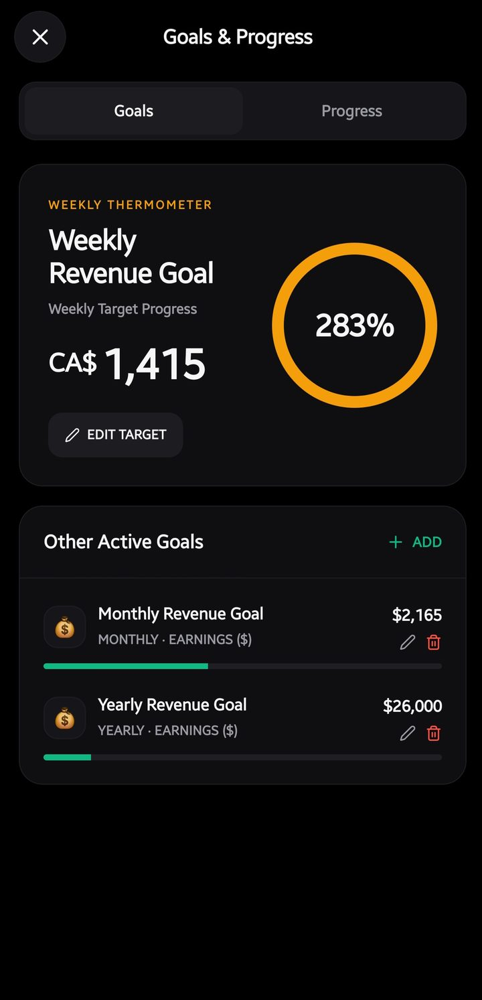
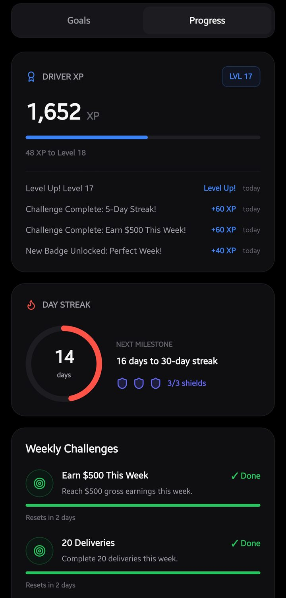
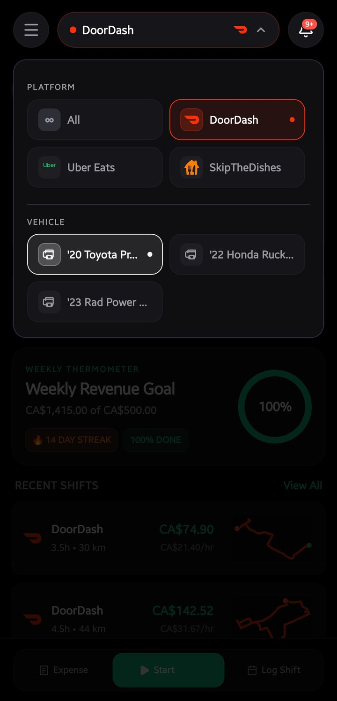

I recently finished building **Comma**, an earnings tracker made for gig workers — the people delivering for DoorDash, Uber Eats, SkipTheDishes, Instacart, and similar platforms. This post is about what it does and why I built it. If you want the technical depth, the [documentation site](https://comma-docs.vercel.app/) and the GitHub repos at the end have all of it.

## The Problem I Wanted to Solve

If you deliver for multiple apps, the question that actually matters is surprisingly hard to answer: **"How much did I really make today?"**

Every app shows you your gross earnings, and those numbers always look better than reality. None of them account for the fuel you burned, the wear on your vehicle, or the taxes you'll owe at the end of the year as a self-employed worker. A $200 day can quietly become a $130 day, and most drivers never see that math until tax season.

Gig work is a business. I wanted drivers to be able to run it like one.

## What Using Comma Feels Like

The experience is simple by design. You start a shift, drive, and end the shift. Comma quietly records the route, the distance, and the time. You log what you earned and what you spent, and it gives you back the numbers that actually matter:

- Your **true net hourly rate** — after fuel, maintenance, and vehicle costs
- How much you should **set aside for taxes**, based on your region's rules
- Which of your expenses are **tax-deductible**, flagged automatically
- Which app and which vehicle is actually **worth your time**

Every expense you log gets categorized, deductible items get flagged, and at the end of the month you can pull a clean report or export everything to CSV — whether you drive one car or juggle a car, a scooter, and an e-bike:

To keep the daily grind from feeling like accounting homework, there is a bit of fun layered on top — weekly goals, streaks, XP levels, and badges. It sounds small, but seeing a streak build up genuinely changes how consistently you log things.

## Everything Stays on Your Device

This was the one rule I refused to break: **your financial data never leaves your phone.**

There is no account to create, no email, no password, and no server collecting your income history. Everything lives locally on your device. If you want a backup, you can connect your own Google Drive — but that is your choice and your storage, not mine.

For an app that knows exactly how much money you make, I think that should be the default, not a premium feature.

## One Idea, Two Apps

Comma ended up as two projects that share the same idea and the same backup format:

- **The web app** — a Progressive Web App that runs entirely in the browser, works offline, and installs like a native app. No frameworks, just fast.
- **The Android app** — a native mobile app with background GPS tracking, so your routes and billable mileage get recorded even while you're heads-down doing deliveries.

Building the same product twice, in two very different ways, taught me more than either project would have alone — especially about keeping data models compatible so a backup from one can restore into the other.

## Where It Stands

Comma is open source under the MIT license, with no paywall on anything. Tax rules currently cover the US, Canada, UK, and Nepal, with Ontario being the most complete — and the whole regional system is built so that new regions and platforms can be added by contribution.

If you drive for gig apps, or know someone who does, I'd genuinely love for you to try it and tell me where it falls short.

## Explore the Project

Read the docs for guides, architecture, and setup: [comma-docs.vercel.app](https://comma-docs.vercel.app/)

The web app:
<LinkCard title="github.com/raiz-toff/comma" href="https://github.com/raiz-toff/comma" />

The Android app:
<LinkCard title="github.com/raiz-toff/commaApp" href="https://github.com/raiz-toff/commaApp" />
