### Phase 1: Enable Nested Virtualization

EVE-NG requires nested virtualization to run node images.

1. SSH into your Proxmox host.
2. Verify current status by running:

   Bash

   ```
   cat /sys/module/kvm_intel/parameters/nested  --- my output is Y      
   ```

   \_(If you have an AMD processor, replace `intel` with `amd`).
   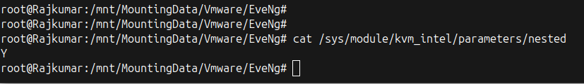
   If the output is `Y` (or `1` for AMD), skip to Phase 2.
   'ENABLED OUTPUT lOOKS LIKE ABOVE

3. Enable it by running the following commands:

   **For Intel:**

   Bash

   ```
   echo "options kvm-intel nested=Y" > /etc/modprobe.d/kvm-intel.conf
   modprobe -r kvm_intel
   modprobe kvm_intel
   ```

   **For AMD:**

   Bash

   ```
   echo "options kvm-amd nested=1" > /etc/modprobe.d/kvm-amd.conf
   modprobe -r kvm_amd
   modprobe kvm_amd
   ```

---

### Phase 2: Create the Proxmox VM

1. Download the **EVE-NG CE 6.2.0-4 ISO** from the official website and upload it to your Proxmox storage. (Via Web or Tftp )
2. Click **Create VM** in the Proxmox GUI.
   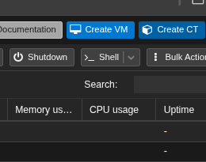
3. **OS:** Select the uploaded EVE-NG ISO. Set Type to `Linux`.
   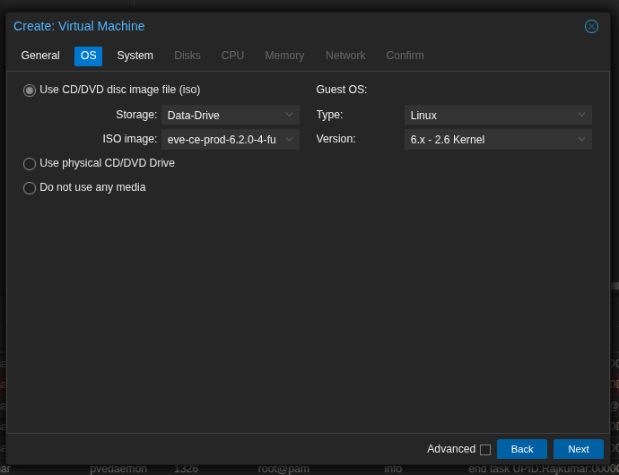
4. **System:** Keep defaults.
5. **Disks:** Set Bus/Device to **`VirtIO Block`**. Allocate at least 50GB (100GB+ is recommended for storing multiple node images).
   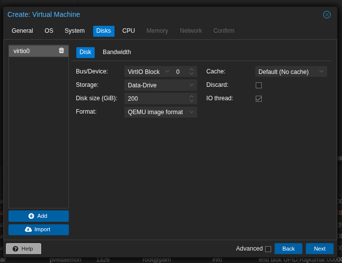
6. **CPU:** Allocate your desired cores (minimum 4). Set the CPU Type to **`host`**. This step is mandatory for nested virtualization to pass through to the VM.
   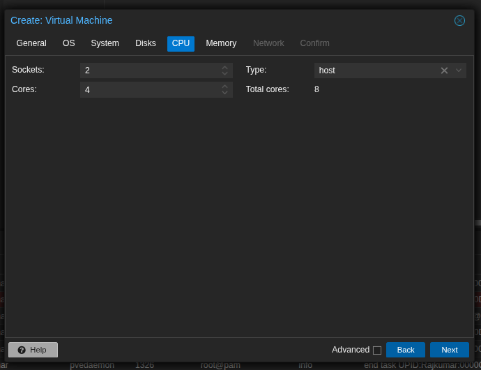
7. **Memory:** Allocate a minimum of 8192 MB (8GB). _Note I have used Extra Be mindful of Your Resources on your server or else VM won't boot _
   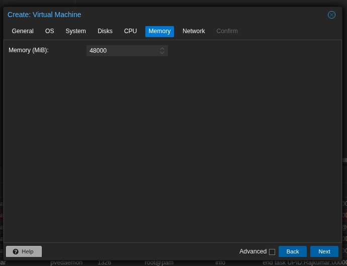
8. **Network:** Keep it bridged to `vmbr0` (or your specific lab network). and Model to Paravituralized  
    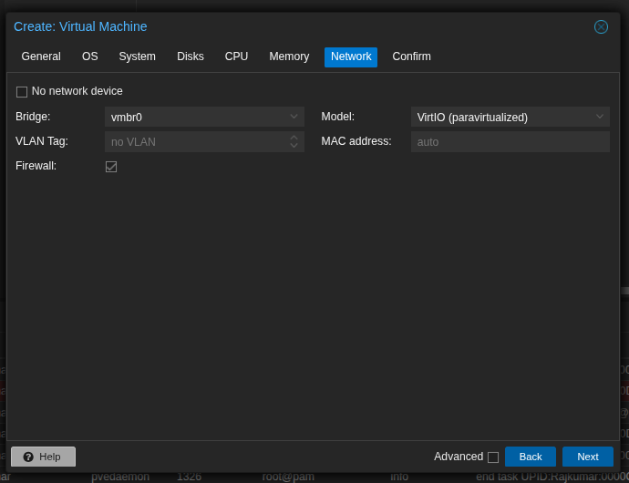
9. Click **Finish**.

---

### Phase 3: Install EVE-NG 6.2.0.4

1.  Start the VM and open the Proxmox Console.
2.  At the boot menu, select **Install EVE-NG Community 6.2.0-4**. _(Note: If this throws partition errors later, restart and choose the "Bare Metal" option instead)._
    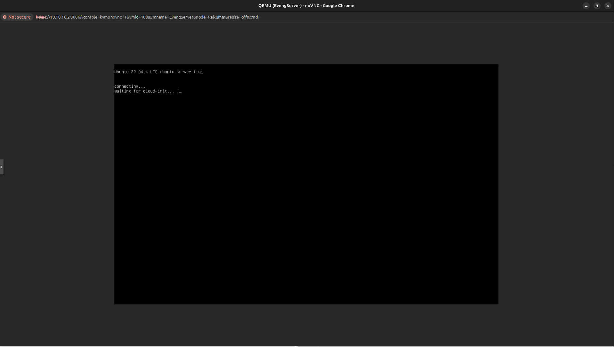
3.  Select your language and keyboard layout.
    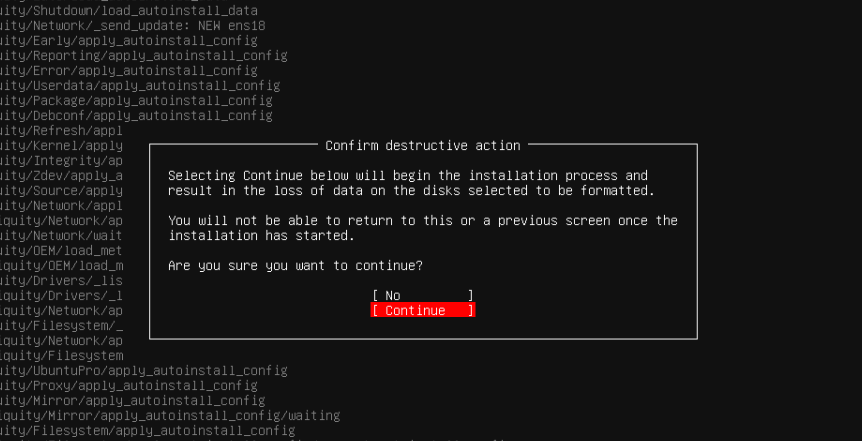
4.  Accept the destructive warning to wipe the virtual disk and install Ubuntu/EVE.
    
5.  Wait for the installation to finish and the VM to reboot automatically. _It may ask the credential provided below without rebooting_
    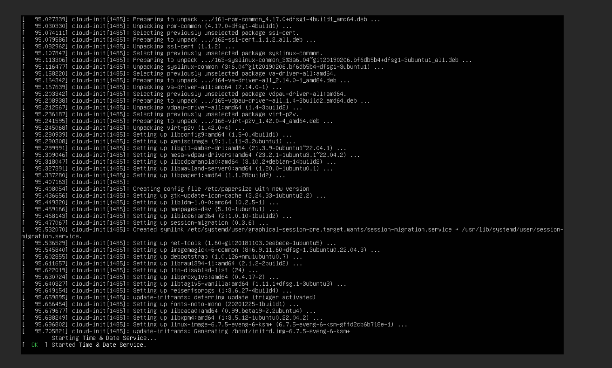
6.  When the login prompt appears, do not use the web interface yet. Log into the console using the default credentials:
    - **Username:** `root`
    - **Password:** `eve`

7.  The EVE-NG setup wizard will launch automatically. Follow the prompts to configure:
    - Root password
    - Hostname and Domain
    - Network settings (DHCP or Static IP)
    - NTP and DNS servers

8.  The VM will reboot one final time to apply the configuration.
9.  Navigate to the assigned IP address in your web browser. Log in to the GUI using the default web credentials (`admin` / `eve` if you havent changed it during the setup).

    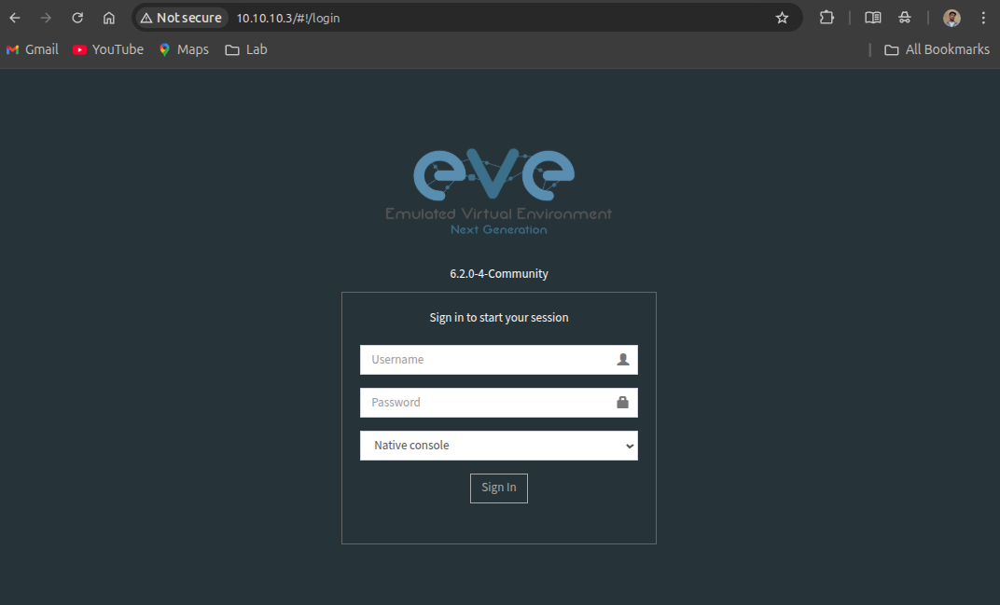

        Yup thats all.
