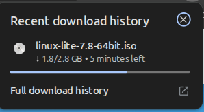
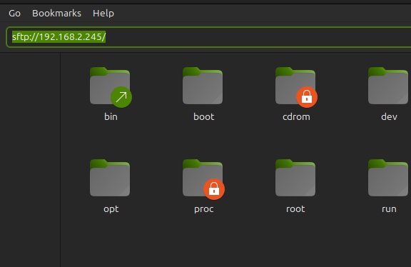
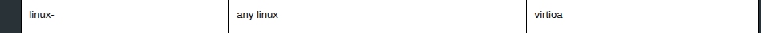
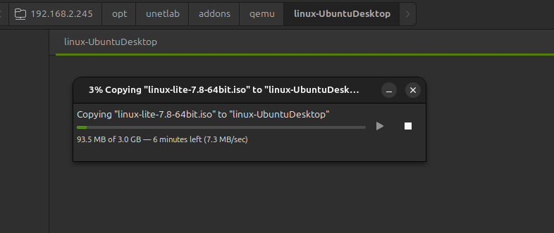

In this guide I will share step by step process to setup a Linux Cloud image in EVE-NG

First we are downloading the image from the EVE-NG website

I am installing linux lite for this guide

Link for the image is :
https://www.linuxliteos.com/download.php

We need to sftp into the eveng server to upload the image i am using my windows Nemo file manager to sftp into the eveng server

if you are in windows you can use FileZilla to sftp into the eveng server or you can use the terminal .

when you hit enter it will ask you for the password and username for the Eveng server.

enter the username and password for the eveng server. default is ( username : root and password : eve)

Now we need to create a directory for the image in the eveng server. We need to follow the naming convention for the image and the image type , i am followign the naming convention given by eveng check it on the eveng website.
https://www.eve-ng.net/index.php/documentation/qemu-image-namings/

Now we need to upload the image to the eveng server. For that we can simple copy the file from downloaded folder to the eveng server. we are connected using the sftp so we can do it using the file manager. if you are in linux you can use the terminal to upload the image via sftp /FTp.

below is the folder path
/opt/unetlab/addons/qemu/

here we make a directory for the image using the naming convention given by eveng

terminal command :
mkdir linux-(anynameyouwant)

cd linux-(youdirname)

Now we need to transfer the image from donwloaded folder to eveng server

Now for the iso image we need to rename it into something like :
