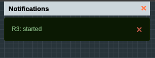
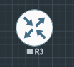
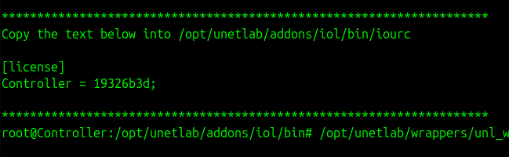

## Troubleshooting Cisco IOL: Why Your Nodes Won't Start in EVE-NG

There are situations where your nodes seem properly configured, naming is correct, symbols are set,
yet when you try to start the node in the EVE-NG lab view, it fails to comeup eventhough the dashboard shows :



You might see the "Node Started" notification, but the icon never turns ON, and you cannot access it via Telnet or HTML console.

I encountered this specifically while trying to run **Cisco IOL (IOS on Linux)** images. Unlike other images, EVE-NG does not provide the license for IOL automatically. You must generate a license key that matches your specific EVE-NG installation's hostname.

Here is the step-by-step fix:

### 1. SSH into your EVE-NG Server

Open your terminal (or PuTTY) and log in to your EVE-NG CLI as root.

### 2. Navigate to the IOL Binary Folder

Move to the specific directory where IOL images and license files are stored:

Bash

```
cd /opt/unetlab/addons/iol/bin/
```

### 3. Create the License Generator Script

Since we need a unique key based on your VM's ID, we will create a small Python script. Run the following command to create a new file:

Bash

```
nano CiscoIOUKeygen.py
```

Paste this Python code into the editor:

Python

```
import os
import socket

# Get HostID and Hostname
hostid = os.popen("hostid").read().strip()
hostname = socket.gethostname()

# Convert hex hostid to integer
ioukey = int(hostid, 16)

# Key calculation logic
for x in range(1, len(hostname) + 1):
    ioukey = ioukey ^ ord(hostname[x - 1])
    ioukey = ioukey ^ (ioukey << 8)

# Mask to 32-bit to prevent "int too large" errors
ioukey &= 0xFFFFFFFF
iouLicense = "%016x" % ioukey
iouLicense = iouLicense[8:]

print("\n*********************************************************************")
print("Create the file /opt/unetlab/addons/iol/bin/iourc with this content:")
print("\n[license]")
print(f"{hostname} = {iouLicense};")
print("\n*********************************************************************")
```

_Press **Ctrl+O**, **Enter** to save, and **Ctrl+X** to exit._

### 4. Generate Your License Key

Run the script using Python 3:

Bash

```
python3 CiscoIOUKeygen.py
```

The script will output a block of text. **Copy the line** that looks like `your-hostname = 0123456789abcdef;`.

I got something like :


### 5. Create the `iourc` License File

Now, you need to save that key into a file named `iourc` in the same directory (Check the DIR — I made a mistake here):

Bash

```
nano iourc
```

Paste the output from the script (including the `[license]` header). It should look like this:

Plaintext

```
[license]
Controller = 0123456789abcdef;
```

> [!NOTE]
> Don't forget the ; I made mistake here.

### 6. The Final Step: Fix Permissions

EVE-NG is very strict about file permissions. Even with a valid license, the node won't start if the permissions aren't synced. Run this command to finalize everything:

Bash

```
/opt/unetlab/wrappers/unl_wrapper -a fixpermissions
```

### Conclusion

Restart the Node.

Go back to your EVE-NG web interface and start your node. It should now turn blue and stay running! You can now right-click and open the console to start configuring your Cisco device.
