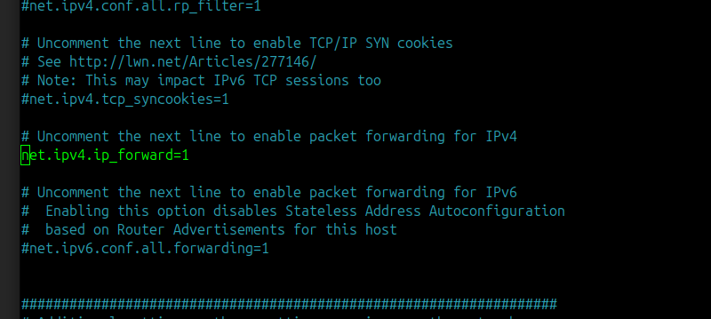

## Forwarding Traffic from Proxmox to the Internet via a Laptop (NAT Routing)

### The Problem

You have a Proxmox server connected directly to your laptop via an Ethernet cable, but it doesn't have internet access. Your laptop connects to the internet via Wi-Fi. You want to share the laptop's Wi-Fi connection with the Proxmox server.

You might hit the classic "Layer 2 Security" wall if you try bridging. Most Wi-Fi Access Points (APs) use **MAC Address Filtering** or **Port Security**, expecting one MAC address per association. When your laptop tries to pass a packet from the Proxmox server (the "static IP device") through Wi-Fi via a bridge, the AP sees a different MAC address and drops the frame.

### The Solution: IP Masquerading (NAT)

To bypass this, you need to move from **Bridging** (Layer 2) to **Routing with NAT** (Layer 3). Instead of a transparent bridge, your laptop will act as a **NAT Router**. The Wi-Fi network will only ever see your laptop's MAC address and IP, even when the traffic actually belongs to your Proxmox server.

By using NAT, your laptop "hides" the Proxmox server's MAC address and replaces it with its own Wi-Fi MAC.

---

### Step-by-Step Configuration on the Laptop

Since the AP blocks multiple MACs, **do not** use a network bridge (`br0`). Follow these steps in your terminal on the accessing machine (e.g., your Ubuntu laptop):

#### Step 1: Enable IP Forwarding

First, you need to enable IP packet forwarding so the Linux kernel can pass packets between the Ethernet and Wi-Fi interfaces.

```bash
sudo sysctl -w net.ipv4.ip_forward=1
```



#### Step 2: Identify Network Interfaces

Find the names of your Wi-Fi interface (e.g., `wlo1`, `wlan0`, or `wlp...`) and your Ethernet interface (e.g., `enp...` or `eth0`). You can do this by running:

```bash
ip link
# OR
ifconfig
```


#### Step 3: Set Up IPTables NAT Rules

Now, apply the NAT rules to route traffic. **Make sure to replace `wlan0` with your actual Wi-Fi interface and `eth0` with your actual Ethernet interface** connected to the Proxmox server.

```bash
# 1. Clear existing rules (optional - use with caution if you have other NAT rules)
sudo iptables -F
sudo iptables -t nat -F

# 2. Enable NAT (Masquerading) on the Wi-Fi interface
# This hides the Proxmox server's MAC/IP behind your laptop
sudo iptables -t nat -A POSTROUTING -o wlan0 -j MASQUERADE

# 3. Allow traffic to flow from Ethernet to Wi-Fi
sudo iptables -A FORWARD -i eth0 -o wlan0 -j ACCEPT
sudo iptables -A FORWARD -m conntrack --ctstate RELATED,ESTABLISHED -j ACCEPT
```

_Note: In the command above, change `eth0` to your exact Ethernet interface name (like `enp0s3`) and `wlan0` to your exact Wi-Fi interface name (like `wlo1`)._

---

### Making it Permanent

> [!NOTE]
> The `iptables` rules and `sysctl` changes will disappear after a reboot. To make them stick permanently, you need to save them.

1. **Sysctl:** Edit `/etc/sysctl.conf` and uncomment or add the line `net.ipv4.ip_forward=1`.
2. **Iptables:** Install the `iptables-persistent` package to save your rules across reboots:

```bash
sudo apt update
sudo apt install iptables-persistent
sudo netfilter-persistent save
```

---

### Summary:

When the Proxmox server sends a packet to the internet:

1. It hits your laptop's Ethernet port.
2. The **NAT engine** (`iptables`) strips the Proxmox server's original MAC address.
3. It re-encapsulates the data in a new frame using your **laptop's Wi-Fi MAC address**.
4. The Wi-Fi AP sees a packet coming from your laptop (which is already authorized) and lets it pass perfectly.
