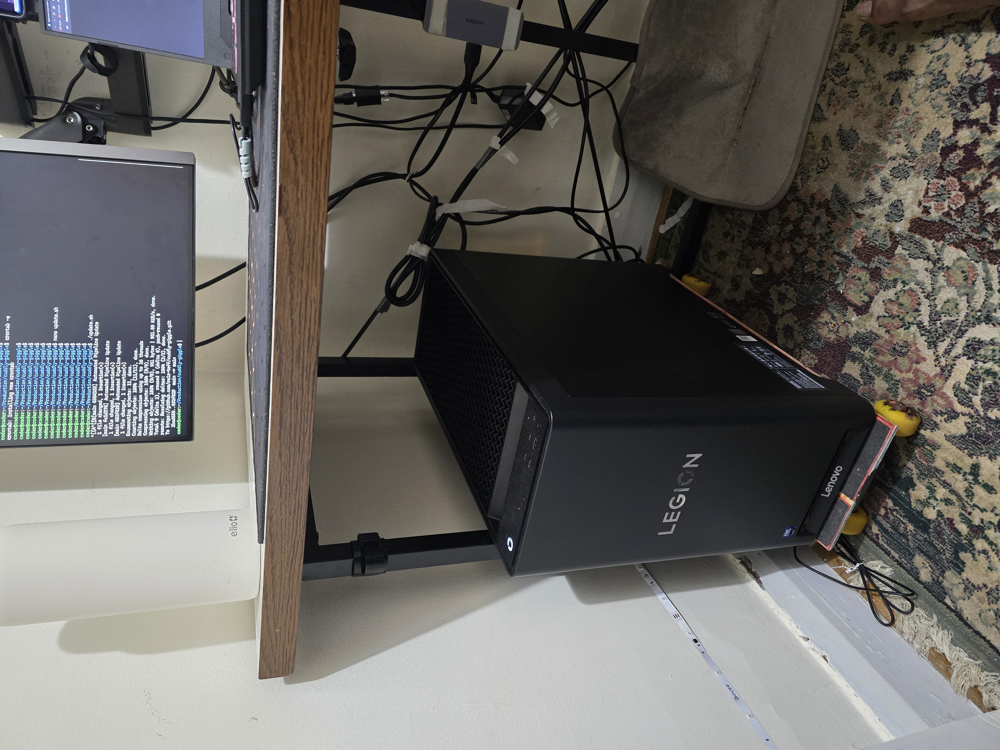
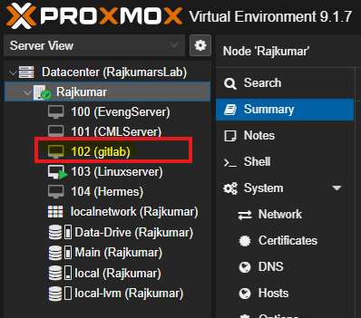
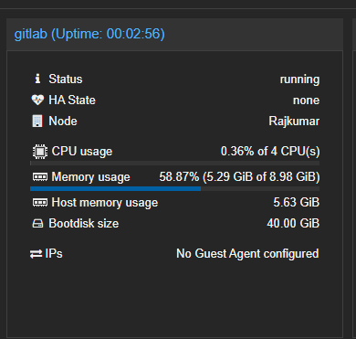
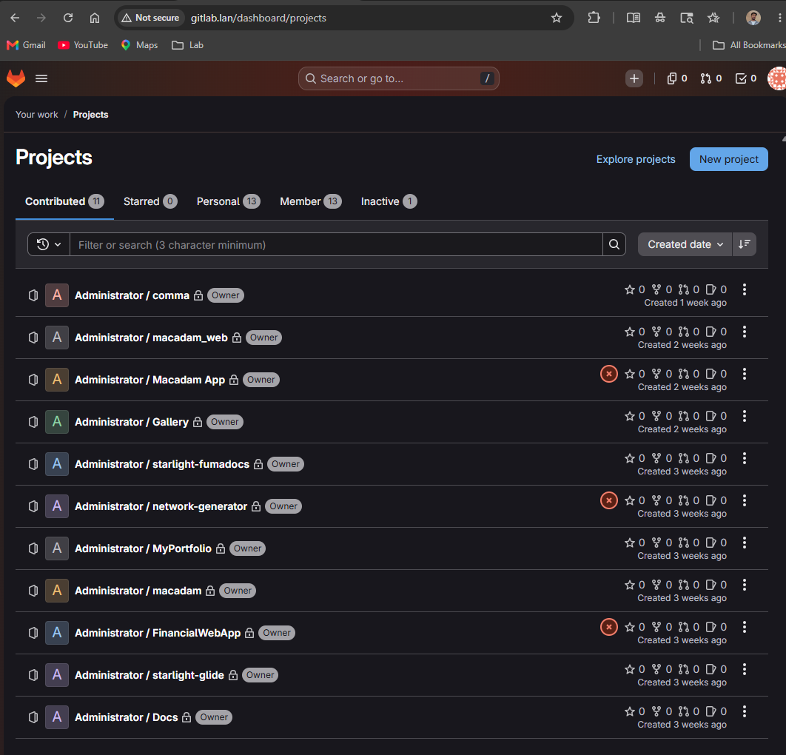
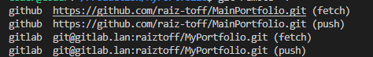

Today I am documenting how I set up my local GitLab server on my Proxmox VE host. My goal is to utilize dual Git Remote Repositories for my projects—one targeting my local development environment (GitLab) for CI/CD pipelines, and one targeting production (GitHub).

## My Proxmox Lab Environment

I host all my homelab projects on a dedicated Proxmox VE server running at home. While I push my production code to GitHub, having a local GitLab instance allows me to experiment with local pipelines, automation, and registry setups without using cloud minutes.

This is my current hardware setup:  

Here is a view of my Proxmox VE node dashboard displaying my resource allocation:

## The Deployment: VM vs. LXC

When starting out, many tutorials suggest running GitLab inside a Proxmox LXC container because it uses fewer resources. However, after trying that approach, I hit several systemd and permission snags.

<Callout type="warn" title="Gotcha">
**Goal:** Install GitLab inside a Proxmox LXC container.

**Reality:** GitLab is highly resource-intensive and running its omnibus package inside an unprivileged LXC container led to complex mounting and systemd failures.

**Fix:** Deploying GitLab on a standard Virtual Machine (VM) was much cleaner and resolved all systemd integration issues out-of-the-box.
</Callout>

## Hardware & Resource Allocation

GitLab recommends a minimum requirement of 4GB of RAM, 2 vCPUs, and 25GB of storage. To ensure smooth operation and account for omnibus services, I decided to double those allocations.

Here are the VM hardware specifications I configured:

> [!NOTE]
> GitLab's initial startup and reconfig tasks take a significant amount of time after reboots. During installation, you will have plenty of time to grab a coffee or tea! ☕

## Post-Installation & Network Configuration

After getting GitLab installed, I placed the VM on my local VLAN. My DHCP server automatically assigned it a dynamic IP address. However, for a persistent server that local machines push to, relying on DHCP is a recipe for broken remotes.

<Callout type="warn" title="Gotcha">
**Goal:** Ensure persistent local domain resolution to the GitLab instance by mapping the DHCP IP in the Windows host file.

**Reality:** Upon rebooting the host or VM, the DHCP server assigned a new IP address, silently breaking DNS resolution and locking me out of GitLab.

**Fix:** Assigned a static IP to the GitLab VM via Proxmox network interface settings and updated/cleaned the Windows hosts file entry.
</Callout>

Now the server is fully reachable at its static IP, and local push/pull pipelines are running smoothly!

## Project Migration & Dashboard

Here is a view of my GitLab dashboard after migrating my local repositories over:

## Lessons Learned: Managing Multiple Remotes

Configuring and handling different Git remote locations for the same repository can be tricky to wrap your head around at first. It becomes much easier if you designate one remote as your default upstream (e.g., `origin` pointing to your local GitLab server for development) and configure secondary remotes (like `production` pointing to GitHub) for deploying release branches:

