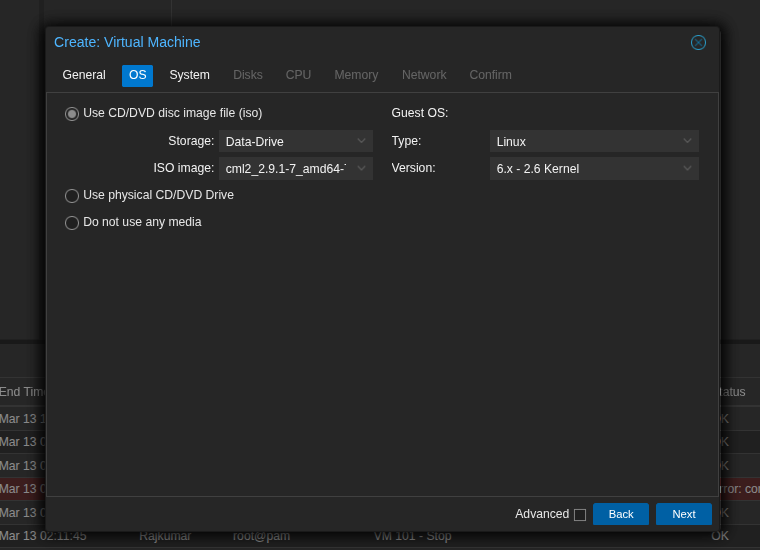
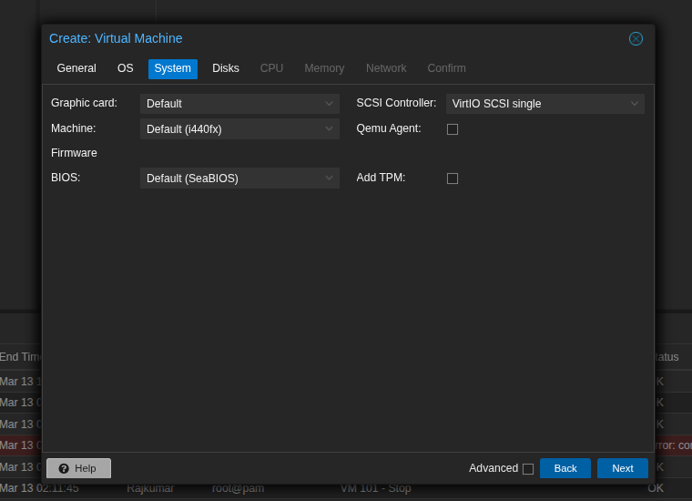
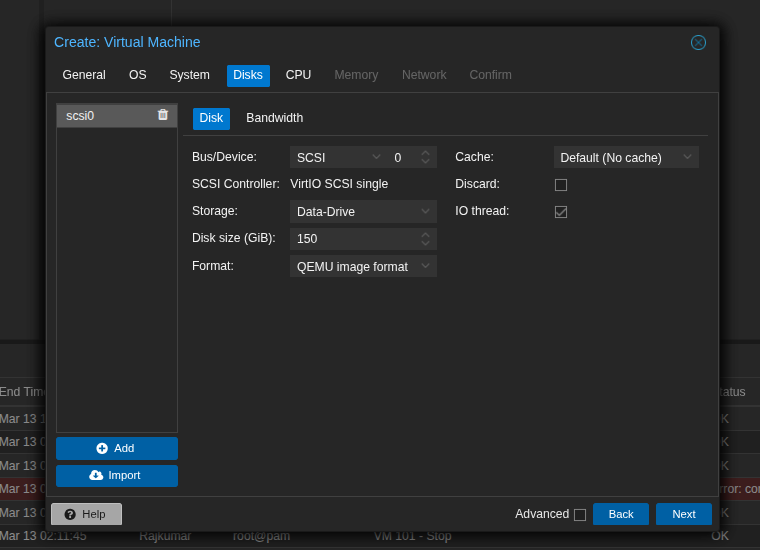
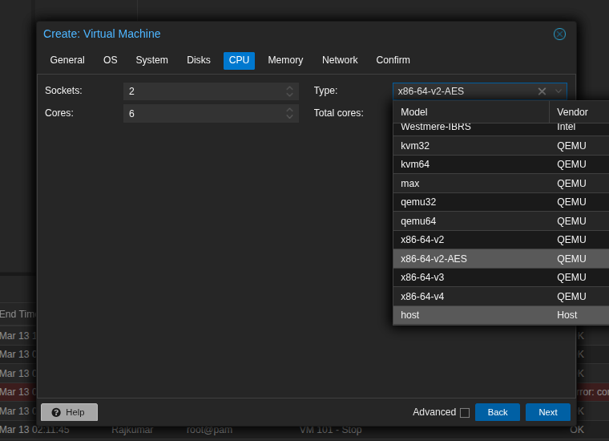
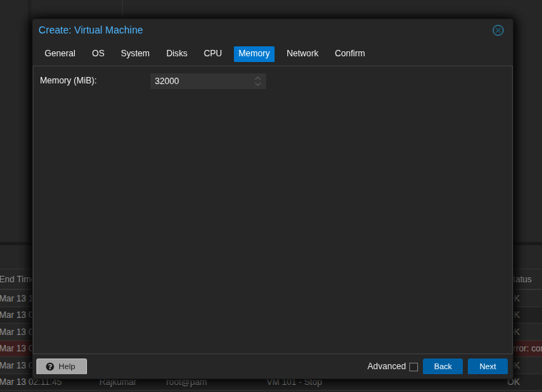
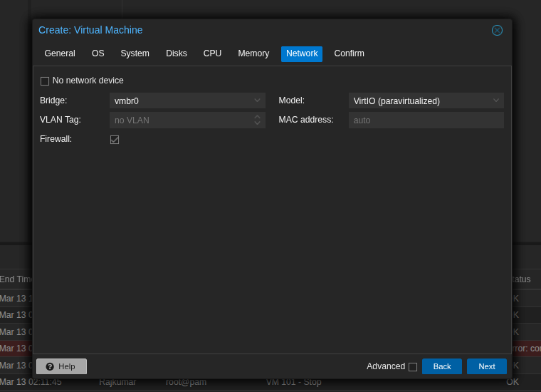
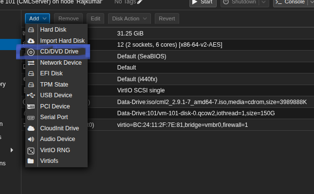
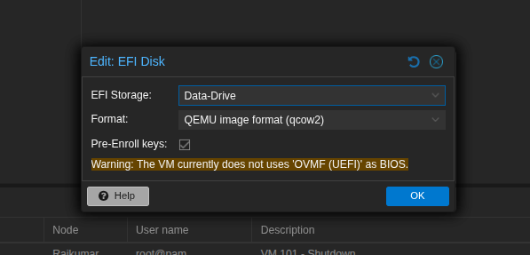
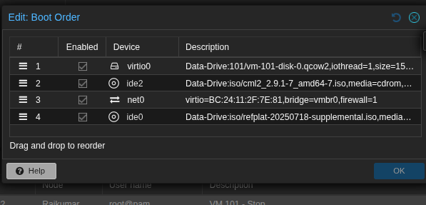
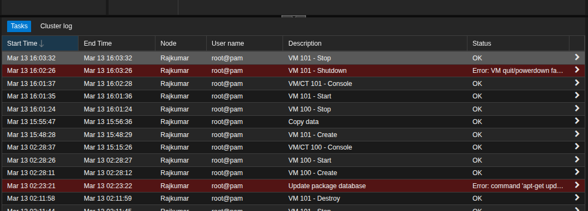

## Prerequisites

- A working Proxmox VE server.
- Cisco CML Personal license.
- Downloaded CML files from Cisco:
  - **CML Installer ISO** (`cml2.9.1-7.iso` is the latest as of Dec 2025)
  - **CML Reference Platform ISO** (`refplate_2.9.1.iso`)

## Step 1: Enable Nested Virtualization (Host Level)

CML requires nested virtualization to run router/switch nodes. Run this on your Proxmox host shell:

1. Check if enabled: `cat /sys/module/kvm_intel/parameters/nested` (or `kvm_amd` for AMD). It should return `Y` or `1`.
2. If `N` or `0`, enable it:
   - **Intel:** `echo "options kvm-intel nested=Y" > /etc/modprobe.d/kvm-intel.conf`
   - **AMD:** `echo "options kvm-amd nested=1" > /etc/modprobe.d/kvm-amd.conf`

3. Reboot the Proxmox host or reload the KVM module.

## Step 2: Upload CML ISOs

1. In Proxmox, navigate to your storage drive (e.g., `local`).
2. Select **ISO Images** > **Upload**.
3. Upload both the CML Installer ISO and the Reference Platform ISO.

## Step 3: Create the Virtual Machine

Create a new VM with the following specific settings:

- **General:** Name the VM (e.g., `CML-Personal`).
- **OS:** Select the **CML Installer ISO**. Guest OS: Linux (6.x - 2.6 Kernel).
  
- **System:** Leave as default (OVMF, i440fx). I made mistake on image below had to change it afterward.
  
- **Disks:** Minimum **32 GB** (SCSI or VirtIO). _Note: 150GB+ is recommended if you have CML personal License to store any images and labs._ I am using 150GB
  
- **CPU:** Minimum **4 Cores**. **CRITICAL:** Set the Type to **Host** (enables nested virtualization for the VM).
  
- **Memory:** Minimum **8192 MB** (16384 MB+ highly recommended). I am using around 32 GB
  
- **Network:** VirtIO (Paravirtualized), bridged to your active network (e.g., `vmbr0`). Leaving it default
  

## Step 4: Mount the Reference Platform ISO

Before booting the VM:

1. Go to the VM's **Hardware** tab in Proxmox.
2. Click **Add** > **CD/DVD Drive**.
   
3. Select the **CML Reference Platform ISO** (attach it to an available IDE or SCSI slot).
4. Make sure to add a EFI disk
    5. Make sure to check the boot order and everything checked
   
   > [!Tips]
   > Keep eye of task Log list, if you made any mistake it will show it there
   > 

## Step 5: Install CML

1. **Start** the VM and open the **Console**.
2. Follow the text-based setup prompts (set timezone, admin username/password, and networking).
3. When asked about the Reference Platform, select **Copy to Disk** (this copies the images from the second ISO to your VM's hard drive).
4. Once the installation finishes, the VM will provide an IP address on the console screen.

## Step 6: Licensing and Access

1. Navigate to `https://<CML-VM-IP>` in your web browser.
2. Log in using the admin credentials you created. 
3. Go to **Tools** > **Licensing** and register the instance using your CML Personal token. ( They have moved the License to Cisco U site now) 

---
