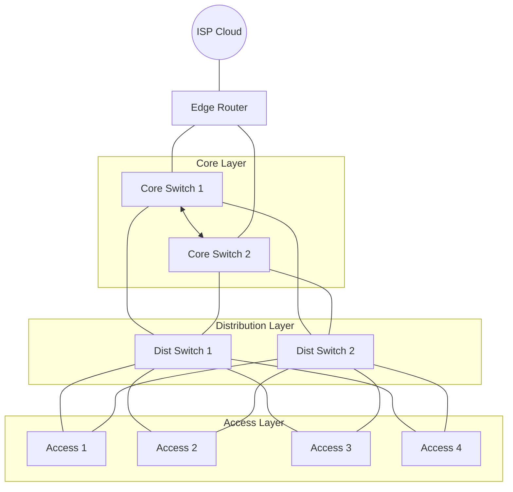

## 1. Project Objective

Design and automate the deployment of a small-to-medium campus network using Ansible or Python (Netmiko/Nornir). The automation should provision VLANs, inter-VLAN routing, OSPF, STP tuning, SSH hardening, and baseline device configuration from a single command.

---

## 2. Recommended Lab Scale

### Core Design Principle

Make it realistic enough to look like a real campus design, but small enough to build in EVE-NG, GNS3, or Cisco CML.

### Node Count (Recommended: 12–16 Devices)

**Core Layer (2 devices)**

- 2x L3 Core Switches (Core1, Core2)

**Distribution Layer (2 devices)**

- 2x L3 Distribution Switches (Dist1, Dist2)

**Access Layer (4 devices)**

- 4x L2 Access Switches (Access1–Access4)

**Edge / WAN (1 device)**

- 1x Edge Router (simulated ISP link)

**Management / Services (2–3 nodes)**

- 1x Automation Host (Ansible control node)
- 1x Syslog/NTP server
- 1x Test Client VM

This gives you ~12–13 total nodes. If you want more complexity, scale access switches to 6–8.

---

## 3. Topology Architecture

### Hierarchical Three-Tier Campus

| **Source Device** | **Source Port** | **Destination Device** | **Destination Port** |
| ----------------- | --------------- | ---------------------- | -------------------- |
| **ISP (Cloud)**   | N/A             | EdgeRouter             | Gi0/0                |
| **EdgeRouter**    | Gi0/1           | Core1                  | e0/0                 |
| **EdgeRouter**    | Gi0/2           | Core2                  | e0/0                 |
| **Core1**         | e0/1            | Core2                  | e0/1                 |
| **Core1**         | e0/2            | Core2                  | e0/2                 |
| **Core1**         | e1/0            | Distribution1          | e0/0                 |
| **Core1**         | e0/3            | Distribution2          | e0/1                 |
| **Core2**         | e1/0            | Distribution2          | e0/0                 |
| **Core2**         | e0/3            | Distribution1          | e0/1                 |
| **Distribution1** | e1/0            | Access1                | Gi0/0                |
| **Distribution1** | e1/1            | Access2                | Gi0/0                |
| **Distribution1** | e1/2            | Access3                | Gi0/0                |
| **Distribution1** | e1/3            | Access4                | Gi0/0                |
| **Distribution2** | e1/1            | Access1                | Gi0/1                |
| **Distribution2** | e1/0            | Access2                | Gi0/1                |
| **Distribution2** | e1/2            | Access3                | Gi0/1                |
| **Distribution2** | e1/3            | Access4                | Gi0/1                |
| **Access1**       | Gi0/2           | Node10 (Laptop)        | e0                   |
| **Access2**       | Gi0/2           | Linux (Server)         | e0                   |
| **Access3**       | Gi0/2           | Linux (Workstation)    | e0                   |
| **Access4**       | Gi0/2           | TestingLinux           | e0                   |

### Design Logic

- Core ↔ Core: Layer 3 link
- Core ↔ Distribution: Layer 3 links (OSPF area 0)
- Distribution ↔ Access: Layer 2 trunks
- Inter-VLAN routing: On Distribution layer
- Default route: From Core to Edge
- OSPF: Between Core and Distribution

---

## 4. VLAN & IP Plan

Example VLANs:

- VLAN 10 – Users
- VLAN 20 – Servers
- VLAN 30 – Voice
- VLAN 40 – Management

IP Example:

- 10.10.10.0/24 – Users
- 10.10.20.0/24 – Servers
- 10.10.30.0/24 – Voice
- 10.10.40.0/24 – Management

Use /30 or /31 for routed point-to-point links.

---

## 5. Automation Scope (What Your Script Must Do)

Your single command should:

1. Configure hostnames
2. Set domain name
3. Generate RSA keys
4. Enable SSH (disable Telnet)
5. Create local admin user
6. Configure NTP + Syslog
7. Configure VLANs (create + name)
8. Configure trunk ports
9. Configure access ports
10. Configure SVIs on Distribution
11. Enable OSPF
12. Configure default route on Core
13. Set STP root primary/secondary
14. Save configuration

That’s a full build from one command, not a handful of lines pushed to a device.

---

## 6. Automation Architecture

### Option A: Ansible

Structure:

- inventory.yaml
- group_vars/
- roles/
  - base_config/
  - vlan/
  - ospf/
  - stp/

Use:

- ios_config
- ios_vlan
- ios_l3_interfaces
- ios_ospfv2

### Option B: Python (More Impressive)

Use:

- Netmiko for CLI push
- Nornir for structured inventory
- Jinja2 templates

Structure:

- inventory.yaml
- templates/
  - base.j2
  - vlan.j2
  - ospf.j2
- deploy.py

---

## 7. Advanced Features

If you want it to stand out:

- Add idempotency check
- Add rollback mechanism
- Add config validation step
- Auto-verify OSPF neighbors
- Auto-check VLAN presence
- Generate post-deployment report

---

## 8. Final Deliverables

1. Topology diagram (draw.io)
2. GitHub repo
3. README explaining architecture
4. Before/After config comparison
5. Demo video

---

Built properly, this project covers:

- Network design
- CCNA/CCNP-level routing logic
- Infrastructure as Code principles
