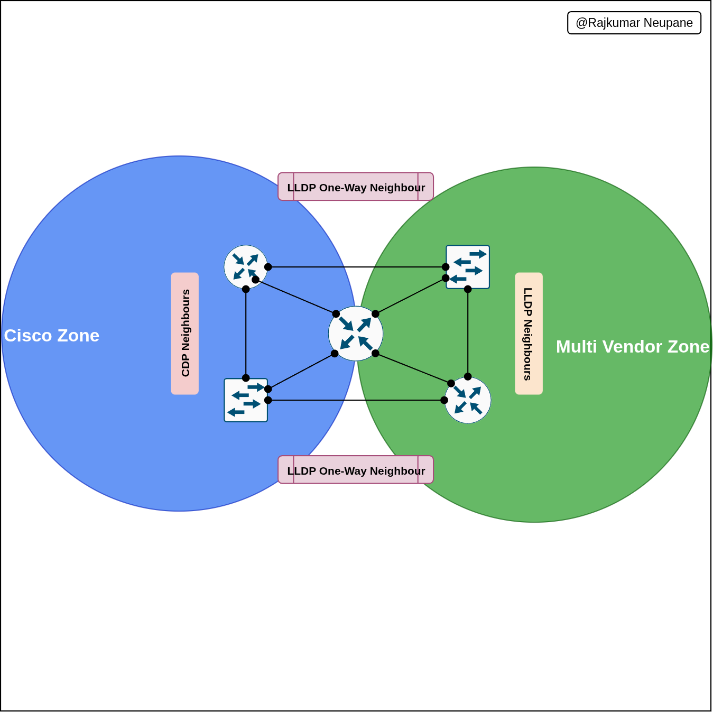

### **Objective**

To design and validate a **multi-vendor network discovery environment** where both **Cisco Discovery Protocol (CDP)** and **Link Layer Discovery Protocol (LLDP)** coexist without interference.  
The goal is to keep Cisco-to-Cisco discovery zones separate from the multi-vendor interoperability zones.


---
### **Scenario Overview**

In a mixed enterprise environment, not all devices support CDP.  
Routers and switches that connect to Cisco equipment use CDP for detailed neighbor discovery, while ports facing third-party or open-standard devices use LLDP.  
Setting it up per interface lets you control which protocol runs on which link and test how the two behave alongside each other.

---

### **Implementation Summary**

| **Device**  | **Cisco Zones (CDP)** | **Multi-Vendor Zones (LLDP)**        | **Protocol Behavior**                                                | **Notes / Purpose**                                              |
| ----------- | --------------------- | ------------------------------------ | -------------------------------------------------------------------- | ---------------------------------------------------------------- |
| **Router1** | e0/1, e0/2            | e0/0, e0/3                           | CDP enabled on Cisco zones; LLDP transmit-only on multi-vendor links | Prevents overlap, shares link info with non-Cisco devices        |
| **Router2** | e0/0, e0/2            | e0/1, e0/3                           | CDP and LLDP separated by interface                                  | Clean protocol boundaries, avoids duplicate discovery            |
| **Router3** | ----                  | All Ethernet ports (LLDP active)     | LLDP transmit-only on e0/2; CDP active only on select Cisco links    | Ensures full LLDP visibility, keeps backward Cisco compatibility |
| **Switch1** | e0/0, e0/1            | e0/2 (receive-only)                  | CDP for Cisco links; LLDP limited to receiving on multi-vendor port  | Acts as bridge between Cisco and multi-vendor zones              |
| **Switch2** | —                     | e0/0–e0/3 (except e0/3 receive-only) | LLDP transmit/receive on all, CDP disabled                           | Pure LLDP environment for interoperability testing               |

---

### **Result**

This topology cleanly divides discovery domains:


- **CDP zones:** internal Cisco-to-Cisco connectivity
    
- **LLDP zones:** external or third-party interoperability points
    

The result splits discovery cleanly: CDP stays inside the Cisco zones, and LLDP handles every link facing another vendor.




Command On Each Device 
## **Router1**

**Goal:**  
CDP on e0/1 & e0/2 (Cisco zone)  
LLDP on e0/0 (Tx/Rx) and e0/3 (Tx only)

```bash
conf t
! --- Enable CDP globally
cdp run
! --- Enable LLDP globally
lldp run

! --- CDP-enabled interfaces
int e0/1
 cdp enable
 no lldp transmit
 no lldp receive
exit

int e0/2
 cdp enable
 no lldp transmit
 no lldp receive
exit

! --- Unused Port 
int e0/0
 no cdp enable
 no lldp transmit
 no lldp receive
exit
! --- LLDP-enabled interface
int e0/3
 no cdp enable
 lldp transmit
 no lldp receive
exit

```

---

## **Router2**

**Goal:**  
CDP on e0/0 & e0/2  
LLDP on e0/1 & e0/3

```bash
conf t
cdp run
lldp run

! --- CDP zone
int e0/0
 cdp enable
 no lldp transmit
 no lldp receive
exit

int e0/2
 cdp enable
 no lldp transmit
 no lldp receive
exit

! --- LLDP zone
int e0/1
 no cdp enable
 lldp transmit
 lldp receive
exit

int e0/3
 no cdp enable
 lldp transmit
 lldp receive
exit

```

---

## **Router3**

**Goal:**  
CDP disabled Globally
LLDP on all Ethernet ports (Tx/Rx), except e0/2 Tx only 

```bash
conf t
no cdp run
lldp run

! --- LLDP on all Ethernet
int e0/0
 lldp transmit
 lldp receive
exit
! --- UNused Port
int e0/1
 no lldp transmit
 no lldp receive
exit

int e0/2
 lldp transmit
 no lldp receive
exit

int e0/3
 lldp transmit
 lldp receive
exit

! --- CDP kept for Serial interfaces in CML entering Serial interface of this device is not permit
int range s1/0 - 1/3
 no lldp transmit
 no lldp receive
exit

end
wr
```

---

## **Switch1**

**Goal:**  
CDP on e0/0 & e0/1  
LLDP receive-only on e0/2

```bash
conf t
cdp run
lldp run

! --- Cisco zone (CDP)
int e0/0
 cdp enable
 no lldp transmit
 no lldp receive
exit

int e0/1
 cdp enable
 no lldp transmit
 no lldp receive
exit

! --- Multi-vendor receive-only LLDP
int e0/2
 no cdp enable
 no lldp transmit
 lldp receive
exit

! --- Disable LLDP entirely on e0/3
int e0/3
 no cdp enable
 no lldp transmit
 no lldp receive
exit

end
wr
```

---

## **Switch2**

**Goal:**  
CDP  disabled Globally  
LLDP on all interfaces (Tx/Rx), except e0/3 Rx-only

```bash
conf t
no cdp run
lldp run

! --- LLDP full Tx/Rx
int range e0/0 - 2
 no cdp enable
 lldp transmit
 lldp receive
exit

! --- LLDP Rx-only
int e0/3
 no cdp enable
 no lldp transmit
 lldp receive
exit

end
```

---

### Summary Table

|Device|CDP Interfaces|LLDP Interfaces (Tx/Rx)|Special Cases|
|---|---|---|---|
|Router1|e0/1, e0/2|e0/0 (Tx/Rx), e0/3 (Tx only)|–|
|Router2|e0/0, e0/2|e0/1, e0/3|–|
|Router3|e0/1 + Serial ports|e0/0, e0/1, e0/3|e0/2 Tx only|
|Switch1|e0/0, e0/1|e0/2 Rx only|–|
|Switch2|None|e0/0–e0/2 (Tx/Rx)|e0/3 Rx only|

---


[Download](https://github.com/raiz-toff/NETWORKING_LABS/releases/download/PacketTracerFile/MultivendorLabCml.yaml) YAML File For CMLFile


