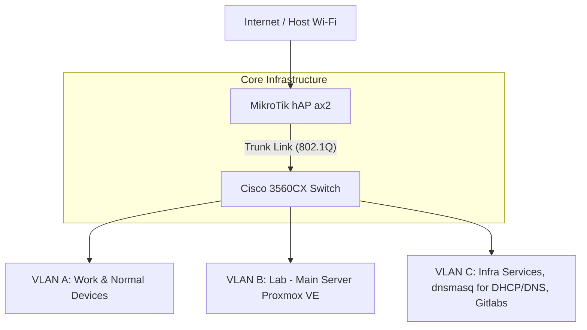

The **"My Homelab"** is a break and glue-it-yourself networking project designed for shared living environments. It creates a completely private, hardware-isolated network inside my room, ensuring my work and lab experiments remain secure and independent from the primary household Wi-Fi. I have learned a lot from this project and still learning. This is the foundation for my other Labs and Projects as it provides me the path to simulate different software such as **EVE-NG**, **GNS3**, **Proxmox VE**, **Packet Tracer**, and **Cisco CML**.

## Overview

The lab utilizes a **Router-on-a-Stick (RoaS)** topology, with a MikroTik gateway handling inter-VLAN routing and a Cisco Catalyst switch managing the physical distribution.

---

## Network Segmentation

<CardGrid stagger>
  <Card title="VLAN A: Work" icon="laptop">
    Work laptop and everyday devices, kept in their own broadcast domain
    away from the lab traffic.
  </Card>
  <Card title="VLAN B: Lab" icon="setting">
    Runs the **Proxmox VE** server for EVE-NG nodes and network
    simulations.
  </Card>
  <Card title="VLAN C: Infrastructure" icon="document">
    Dedicated services segment running local DNS, DHCP (Dnsmasq), and Gitlabs
    for the entire lab.
  </Card>
</CardGrid>

---

## Hardware Stack

<CardGrid>
  <Card title="MikroTik hAP ax²" icon="rocket">
    **Gateway & Router** Handles all Inter-VLAN routing and manages the wireless
    uplink to the internet using Wifi-6/ Wifi Bridge Mode.
  </Card>
  <Card title="Cisco 3560CX" icon="setting">
    **Core Switching** A compact 8-port PoE+ switch managing Layer 2 traffic and
    providing power to lab endpoints.
  </Card>
</CardGrid>

---

## Implementation Timeline

<Steps>
1. **Hardware Acquisition** (March 8, 2026)
   - Sourced core MikroTik and Cisco components from eBay.
   - Selected compact hardware for a portable, desk-friendly setup.

2. **RouterOS Configuration** (March 14, 2026)
   - Deep dive into RouterOS 7.
   - Configured the wireless WAN bridge and initial VLAN tagging.

3. **Cisco Integration** (March 15, 2026)
   - Aligned Cisco VLAN database with MikroTik's logical design.
   - Successfully verified 802.1Q trunking and Inter-VLAN connectivity.
4. **Proxmox VE Integration** (March 16, 2026)
   - Installed Proxmox VE on the lab server.
   - Configured the management interface and integrated it with the lab network.

</Steps>
