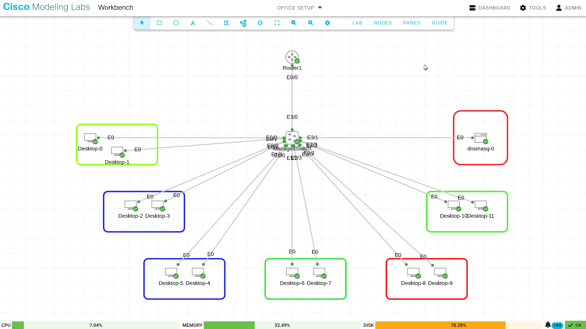
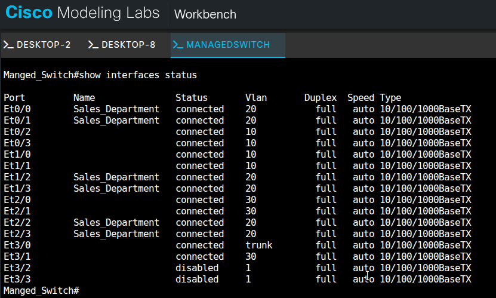
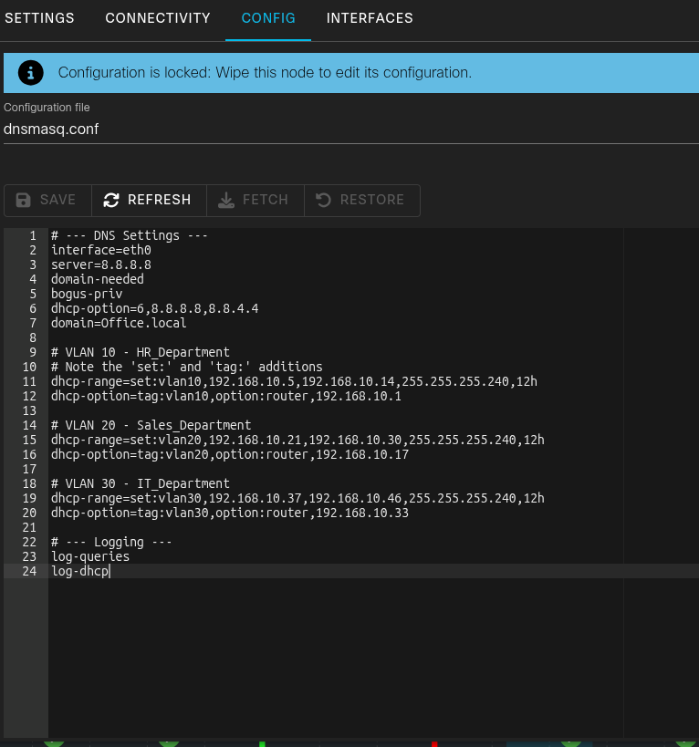
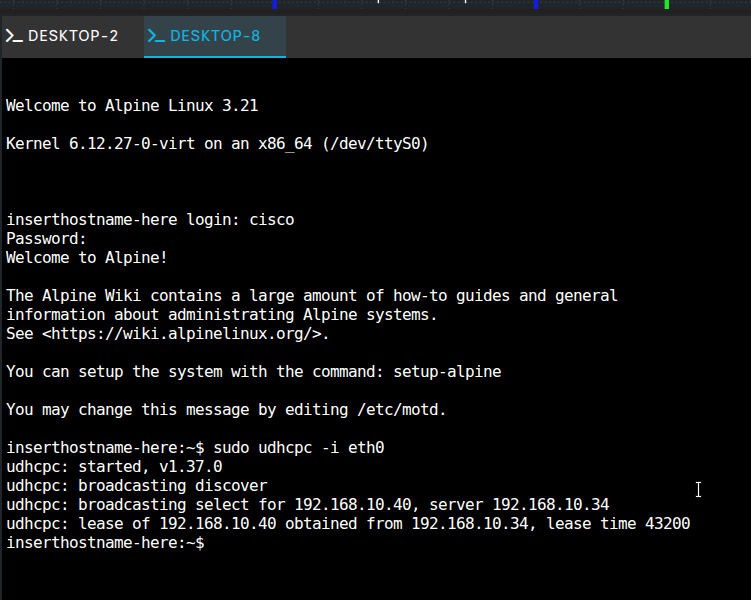
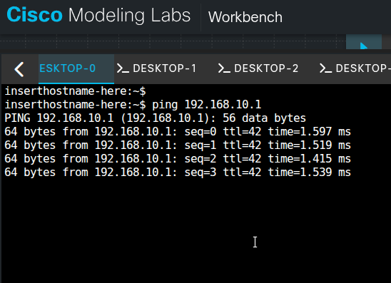
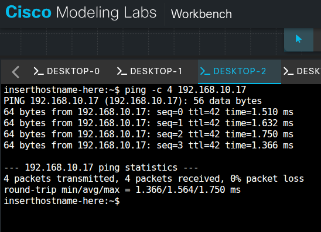

# Network Design Document

**Project Name:** Router A Stick ( ROAS ) Office Network Setup

**Document Version:** 1.1

**Date:** December 25, 2025

**Author:** Rajkumar Neupane

<LinkButton href="https://github.com/raiz-toff/NetworkingLabFiles/blob/main/Office_SetupRouterOnAStickLABCML.yaml" icon="external" size="large">Download the CML lab file</LinkButton>

## 1.0 Overview

This is the network design for the "Lab One" office — 12 devices across three departments (HR, Sales, and IT). It uses a **Router-on-a-Stick (ROAS)** setup for inter-VLAN routing and a central **Dnsmasq** server for IP addressing and name resolution.

> 

---

## 2.0 Hardware Inventory

Hardware used in this build:

**Table 1: Equipment List**

| **Device Type** | **Quantity** | **Description**              | **Role**                                    |
| --------------- | ------------ | ---------------------------- | ------------------------------------------- |
| **Router**      | 1            | Cisco IOSv Router            | WAN Gateway, Inter-VLAN Routing (ROAS)      |
| **Switch**      | 1            | Cisco IOSv-L2 Managed Switch | Access Layer, VLAN Segmentation (802.1Q)    |
| **Endpoints**   | 12           | Alpine Linux Desktops        | End-user workstations for HR, Sales, and IT |
| **Server**      | 1            | Dnsmasq Docker Container     | DHCP and DNS Services (Hosted in IT_MGMT)   |

---

## 3.0 Network Topology and VLAN Design

The network is split into four VLANs to keep department traffic separate. Sub-interfaces on the router route traffic between them.

**Table 2: VLAN Configuration**

| **VLAN ID** | **Name**   | **Department**  | **Subnet**       | **Gateway IP** |
| ----------- | ---------- | --------------- | ---------------- | -------------- |
| **10**      | HR_DATA    | Human Resources | 192.168.10.0/28  | 192.168.10.1   |
| **20**      | SALES_DATA | Sales           | 192.168.10.16/28 | 192.168.10.17  |
| **30**      | IT_MGMT    | IT Support      | 192.168.10.32/28 | 192.168.10.33  |
| **99**      | NATIVE     | Management      | 192.168.10.48/28 | 192.168.10.49  |

---

## 4.0 Switch Port Assignment

The managed switch has access ports assigned per department and a trunk port for the router uplink. **Port Security** limits each access port to a single MAC address, and **Spanning-Tree PortFast** brings access ports up immediately instead of running them through the listening and learning states.

**Table 3: Physical Port Mapping**

| **Switch Interface**                         | **VLAN** | **Department** | **Connected Device**          |
| -------------------------------------------- | -------- | -------------- | ----------------------------- |
| **Et0/2, Et0/3, Et1/0, Et1/1**               | 10       | HR             | Desktops 2, 3, 5, 6           |
| **Et0/0, Et0/1, Et1/2, Et1/3, Et2/2, Et2/3** | 20       | Sales          | Desktops 0, 1, 6\*, 7, 10, 11 |
| **Et2/0, Et2/1**                             | 30       | IT             | Desktops 8, 9                 |
| **Et3/1**                                    | 30       | IT             | **Dnsmasq Server**            |
| **Et3/0**                                    | Trunk    | Uplink         | Router1 (Ethernet 0/0)        |

> 

---

## 5.0 Core Services Configuration

### 5.1 DHCP and DNS (Dnsmasq)

The network uses a central Dnsmasq server located at **192.168.10.34**. It uses **Tagging** logic to provide unique gateways for each VLAN while sharing a common DNS pool.

**Dnsmasq Configuration Snippet:**

Bash

```
# VLAN 10 - HR_Department
dhcp-range=set:vlan10,192.168.10.5,192.168.10.14,255.255.255.240,12h
dhcp-option=tag:vlan10,option:router,192.168.10.1

# VLAN 20 - Sales_Department
dhcp-range=set:vlan20,192.168.10.21,192.168.10.30,255.255.255.240,12h
dhcp-option=tag:vlan20,option:router,192.168.10.17
```

> 

---

## 6.0 Implementation Verification

### 6.1 DHCP Lease Success

Successful implementation is verified by the ability of Alpine Linux clients to pull correct IP addresses from the designated subnets. All clients successfully reached the relay agent at **192.168.10.34**.

**Verification Log (Desktop 0 - Sales):**

Bash

```
inserthostname-here:~$ sudo udhcpc -i eth0
udhcpc: broadcasting select for 192.168.10.21, server 192.168.10.34
udhcpc: lease of 192.168.10.21 obtained from 192.168.10.34
```

> 

### 6.2 Connectivity Testing

Connectivity is confirmed via ICMP ping tests:

1. **Local Gateway Ping:** Clients can ping their respective sub-interfaces (e.g., 192.168.10.1).
   
2. **Inter-VLAN Ping:** Verified communication between HR (VLAN 10) and Sales (VLAN 20).
   

---

## 7.0 Wrap-up

That's the full build: VLANs separate the departments, ROAS routes between them, and Dnsmasq hands out addresses per subnet. The ping tests above confirm both local and inter-VLAN reachability.
