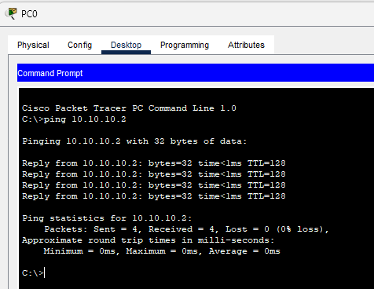
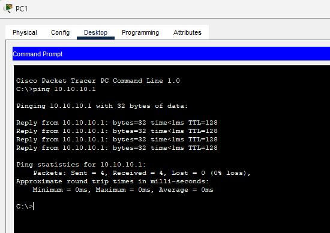
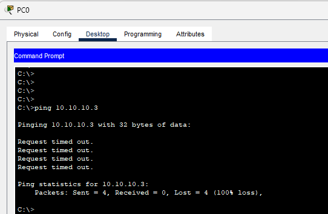
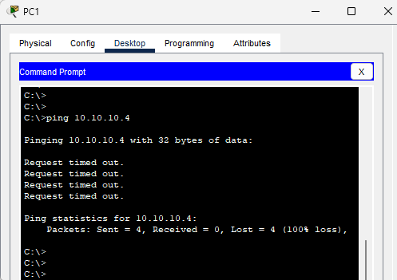
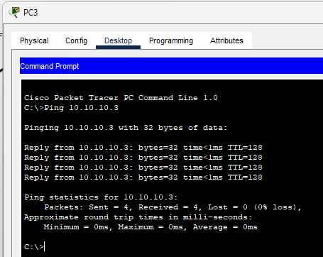
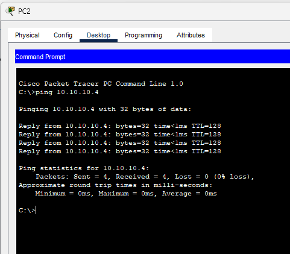
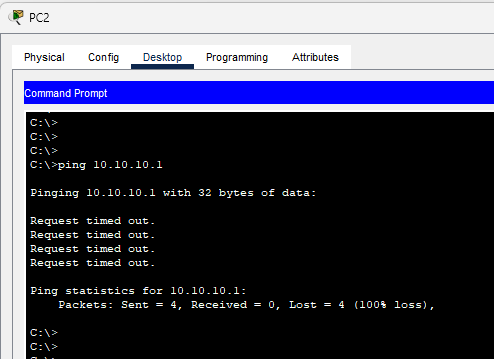

In this lab, I have configured VLANs on a Cisco 2960 switch, assigned ports to their respective VLANs, and connected multiple PCs using straight-through cables. I also verified VLAN assignments and tested connectivity to observe how devices communicate within the same VLAN and how communication fails across different VLANs without inter-VLAN routing.

### **Network Setup Overview**

| **Device** | **VLAN**              | **IP Address** | **Port** | **Cable Type**   |
| ---------- | --------------------- | -------------- | -------- | ---------------- |
| PC0        | VLAN 10 (SALES)       | 10.10.10.1     | Fa0/1    | Straight-through |
| PC1        | VLAN 10 (SALES)       | 10.10.10.2     | Fa0/2    | Straight-through |
| PC2        | VLAN 20 (ENGINEERING) | 10.10.10.3     | Fa0/3    | Straight-through |
| PC3        | VLAN 20 (ENGINEERING) | 10.10.10.4     | Fa0/4    | Straight-through |

**Core Device**: Cisco 2960 Switch

**Note**: All PCs are connected directly to the switch using straight-through Ethernet cables.

---

### **Configuration Steps**

1. **Enable VLANs**:

   ```bash
   Switch(config)# vlan 10
   Switch(config-vlan)# name SALES
   Switch(config)# vlan 20
   Switch(config-vlan)# name Engineering

   ```

2. **Assign Access Ports to VLANs**:

   ```bash
   Switch(config)# interface fa0/1
   Switch(config-if)# switchport mode access
   Switch(config-if)# switchport access vlan 10

   Switch(config)# interface fa0/2
   Switch(config-if)# switchport mode access
   Switch(config-if)# switchport access vlan 10

   Switch(config)# interface range fa0/3 - 4
   Switch(config-if-range)# switchport mode access
   Switch(config-if-range)# switchport access vlan 20

   ```

3. **Shutdown Unused Ports**:

   ```bash

   Switch(config)# interface range fa0/5 - 24
   Switch(config-if-range)# description Inactive ports
   Switch(config-if-range)# shutdown

   Switch(config)# interface range g0/1 - 2
   Switch(config-if-range)# shutdown

   ```

---

### **Verification Commands**

- **Check VLAN assignment**:

  ```bash

  Switch# show vlan brief

  ```

- **Output**:
  ```json
  VLAN Name                             Status    Ports
  ---- -------------------------------- --------- -------------------------------
  1    default                          active    Fa0/5, Fa0/6, Fa0/7, Fa0/8
                                                  Fa0/9, Fa0/10, Fa0/11, Fa0/12
                                                  Fa0/13, Fa0/14, Fa0/15, Fa0/16
                                                  Fa0/17, Fa0/18, Fa0/19, Fa0/20
                                                  Fa0/21, Fa0/22, Fa0/23, Fa0/24
                                                  Gig0/1, Gig0/2
  10   SALES                            active    Fa0/1, Fa0/2
  20   Engineering                      active    Fa0/3, Fa0/4
  1002 fddi-default                     active
  1003 token-ring-default               active
  1004 fddinet-default                  active
  1005 trnet-default                    active
  ```

---

### **Next Steps: Testing Network Connectivity**

---

#### **Pinging PC0 - PC1** _(Sales VLAN: Same VLAN Communication)_

**Success** — Communication succeeds as both PCs are in the **Sales VLAN**.



---

#### **Pinging PC1 - PC0** _(Sales VLAN: Same VLAN Communication)_

**Success** — Same result as above, as both are in the **Sales VLAN**.



---

#### **Pinging PC0 - PC2** _(Sales - HR VLAN: Different VLANs)_

**Failed** — Communication fails as the PCs are in **different VLANs**.



---

#### **Pinging PC1 - PC3** _(Sales - Engineering VLAN: Different VLANs)_

**Failed** — Communication is blocked due to the PCs being in **different VLANs**.



---

#### **Pinging PC2 - PC3** _(HR - Engineering VLAN: Same Network Configuration)_

**Success** — These PCs can communicate as they are part of the **HR** and **Engineering VLANs**, which are properly routed.



---

#### **Pinging PC3 - PC2** _(HR - Engineering VLAN: Same Network Configuration)_

**Success** — As above, the PCs can ping each other successfully.



---

#### **Pinging PC0 - PC2** _(Sales - HR VLAN: Different VLANs)_

**Failed** — Ping failed due to being on different VLANs.



---

### **Network Ping Results Overview**

| **Source** | **Destination** | **VLANs**                    | **Ping Result** | **Explanation**                                                             |
| ---------- | --------------- | ---------------------------- | --------------- | --------------------------------------------------------------------------- |
| **PC0**    | **PC1**         | **Sales VLAN**               | **Success**     | Both PCs are in the same VLAN (Sales), so direct communication is possible. |
| **PC0**    | **PC2**         | **Sales - HR VLAN**          | **Failed**      | PCs in different VLANs, no routing configured.                              |
| **PC1**    | **PC3**         | **Sales - Engineering VLAN** | **Failed**      | Communication blocked by VLAN separation, no inter-VLAN routing available.  |
| **PC2**    | **PC3**         | **HR - Engineering VLAN**    | **Success**     | Routing enabled between HR and Engineering VLANs, successful communication. |
| **PC0**    | **PC3**         | **Sales - Engineering VLAN** | **Failed**      | Devices in different VLANs; routing is required for communication.          |

---

### **Visual Summary**

| **Ping Pair** | **VLAN Connection**                   | **Ping Outcome** |
| ------------- | ------------------------------------- | ---------------- |
| **PC0 - PC1** | Same VLAN (Sales VLAN)                | Success          |
| **PC0 - PC2** | Different VLANs (Sales - HR)          | Failed           |
| **PC1 - PC3** | Different VLANs (Sales - Engineering) | Failed           |
| **PC2 - PC3** | Different VLANs (HR - Engineering)    | Success          |

---

[Download the packet Tracer file](https://github.com/raiz-toff/NETWORKING_LABS/releases/download/PacketTracerFile/VLAN_Access_Port.pkt)
