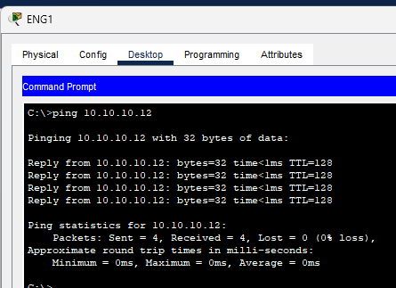
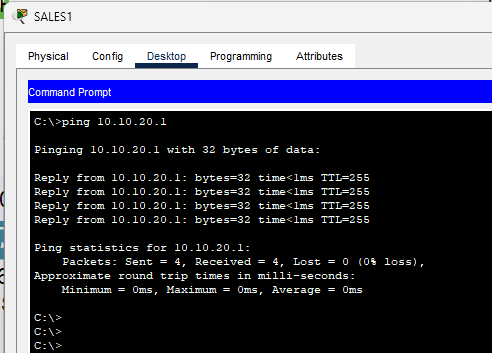
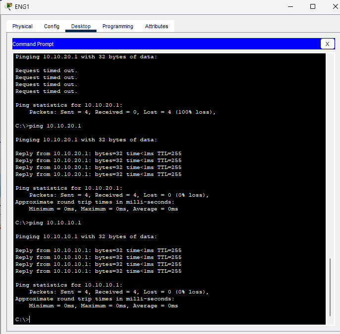
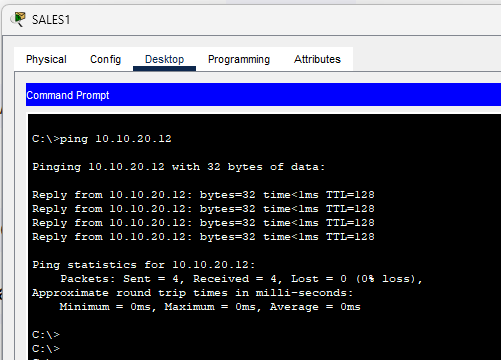
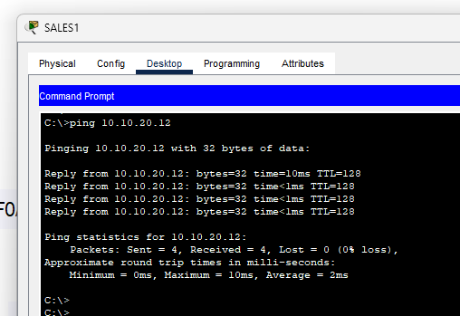
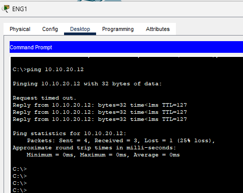
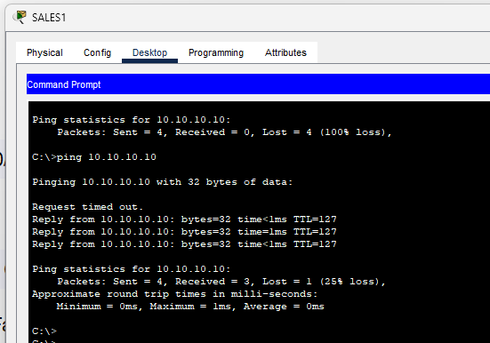

I did this Practice Exercise for CCNA Course ( [Neil Anderson](https://www.udemy.com/course/ccna-complete/) )

# Stage 1

---

**Initial Setup:**

- All switches and routers were in **factory default state**.
- Verified VLAN database using `show vlan brief` – only default VLANs existed.

---

### **Configuration Steps:**

1. **Checked default switchport settings** using:

   `show interfaces switchport`

2. **Configured trunk links** between switches:

   ```bash
   interface Gi0/1
   switchport mode trunk
   switchport trunk native vlan 199

   ```

3. **Configured VTP:**
   - On SW1:

     ```bash
     vtp mode server
     vtp domain FLACKBOX

     ```

   - On SW2:

     ```bash
     vtp mode transparent
     vtp domain FLACKBOX

     ```

   - On SW3:

     ```bash
     vtp mode client
     vtp domain FLACKBOX

     ```

4. **Created VLANs on SW1 (VTP Server):**

   ```bash
   vlan 10
   name ENG
   vlan 20
   name SALES
   vlan 199
   name NATIVE

   ```

5. **VLAN propagation:**
   - Verified VLANs automatically synced to SW3 (Client).
   - SW2 remained unchanged (Transparent mode).
6. **Set trunk native VLAN on all trunk ports for security:**

   ```bash
   switchport trunk native vlan 199

   ```

7. **Configured access ports for PCs:**
   - Example on SW3:

     ```bash
     int range f0/1 - 2
     switchport mode access
     switchport access vlan 10
     int f0/3
     switchport mode access
     switchport access vlan 20

     ```

8. **Resolved native VLAN mismatch errors:**
   - Matched native VLAN (199) on both sides of trunk links.
   - STP blocking issues resolved.

---

### **Verification:**

- Verified VLANs using: `show vlan brief`
- Verified trunk status: `show interfaces trunk`
- Checked PC connectivity with `ping` commands (Eng1 - Eng3, Sales1 - Sales3)

---

## **Stage 2: Inter-VLAN Routing - Option 1**

### **Using Separate Physical Interfaces on Router (R1)**

---

### **Router (R1) Configuration**

1. **Enable and assign IP addresses to interfaces:**
   - `FastEthernet0/0` (for ENG VLAN):

     ```bash
     interface FastEthernet0/0
     ip address 10.10.10.1 255.255.255.0
     no shutdown

     ```

   - `FastEthernet0/1` (for Sales VLAN):

     ```bash
     interface FastEthernet0/1
     ip address 10.10.20.1 255.255.255.0
     no shutdown

     ```

_Both interfaces are UP and functioning_

---

### **Switch (SW2) Configuration**

1. **VLAN Configuration:**
   - VLAN 10 (ENG) and VLAN 20 (Sales) are already created:

     ```bash
     vlan 10
     name ENG

     vlan 20
     name Sales

     ```

2. **Assign VLANs to Ports:**
   - `Fa0/1` → VLAN 10 (ENG):

     ```bash
     interface Fa0/1
     switchport mode access
     switchport access vlan 10

     ```

   - `Fa0/2` → VLAN 20 (Sales):

     ```bash
     interface Fa0/2
     switchport mode access
     switchport access vlan 20

     ```

3. **Trunk Port Configured:**
   - `Gig0/1` set as trunk with native VLAN 199:

     ```bash
     interface Gig0/1
     switchport trunk native vlan 199
     switchport mode trunk

     ```

_VLAN interfaces Vlan10 and Vlan20 are up_

---

### **Verification Steps**

1. **Connectivity from Eng1 (Fa0/1) to R1's VLAN 20 (10.10.20.1)**

   (pending)

1. **Connectivity from Eng1 to Sales1 (across VLANs)**

   



---





---

## **Stage 3: Inter-VLAN Routing - Option 2**

### **Router-on-a-Stick Configuration**

---

### **Router (R1) Configuration**

1. **Clear Existing IPs on Physical Interface**
   - Removed IPs from `FastEthernet0/0` to prepare for subinterfaces.
2. **Configure Sub-Interfaces on FastEthernet0/0:**
   - For VLAN 10 (ENG):

     ```bash
     interface FastEthernet0/0.10
     encapsulation dot1Q 10
     ip address 10.10.10.1 255.255.255.0

     ```

   - For VLAN 20 (Sales):

     ```bash
     interface FastEthernet0/0.20
     encapsulation dot1Q 20
     ip address 10.10.20.1 255.255.255.0

     ```

_Both sub-interfaces are UP and functional_

`*FastEthernet0/0` now acts as trunk carrying tagged VLAN traffic\*

---

### **Switch (SW2) Configuration**

1. **VLAN Setup:**
   - VLANs already exist:

     ```bash
     vlan 10
     name ENG
     vlan 20
     name Sales
     vlan 199
     name NATIVE

     ```

2. **Assign Access Ports:**
   - `Fa0/1` to VLAN 10 (ENG)

     ```bash
     interface Fa0/1
     switchport mode access
     switchport access vlan 10

     ```

   - `Fa0/2` to VLAN 20 (Sales)

     ```bash
     interface Fa0/2
     switchport mode access
     switchport access vlan 20

     ```

3. **Configure Trunk to Router:**
   - `Fa0/1` (connected to R1’s `Fa0/0`) as trunk:

     ```bash
     interface Fa0/1
     switchport trunk encapsulation dot1q
     switchport mode trunk
     switchport trunk allowed vlan 10,20

     ```

_Trunk operational and forwarding VLAN 10 and 20 traffic_

1. **Set Default Gateway on SW2:**

   ```bash
   ip default-gateway 10.10.10.1

   ```

---

### Verification Steps

1. **PC Eng1 (VLAN 10)** should be able to:
   - Ping `10.10.20.1` (R1’s subinterface for VLAN 20)
   - Ping Sales1 PC

   

   Pinging Sales 3 from Eng 1

   

Pinging Eng1 from Sales 1



## Conclusion

This lab covered three things: VLAN segmentation with VTP across multiple switches, inter-VLAN routing over separate physical interfaces, and the same routing done with router-on-a-stick subinterfaces. Along the way it meant working through the different VTP modes and sorting out a native VLAN mismatch. Every ping test between VLANs passed.
