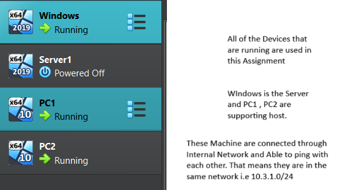
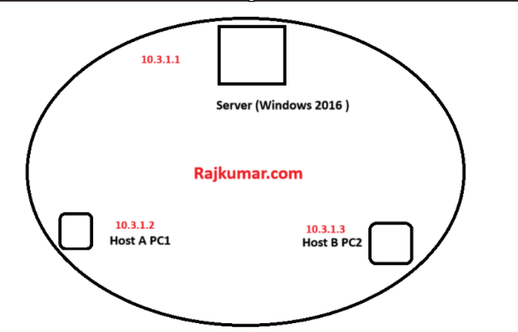
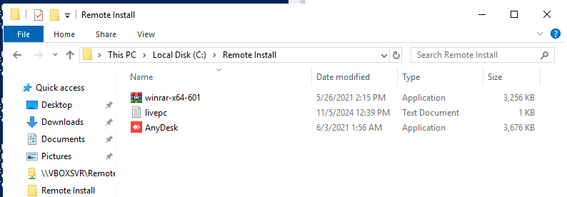
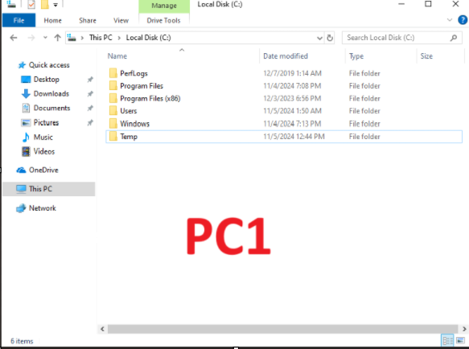
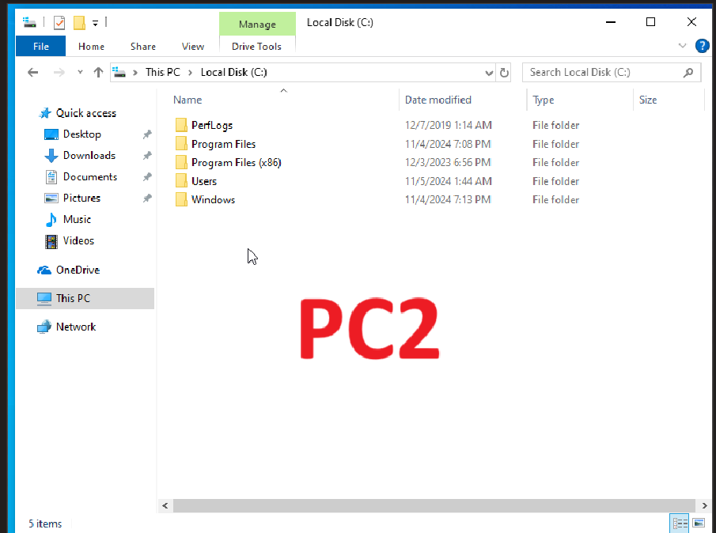
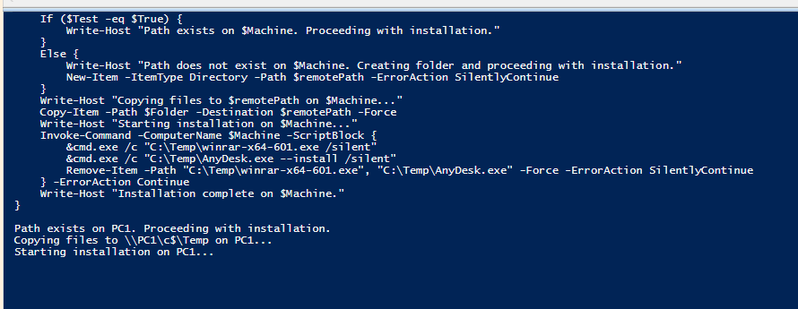
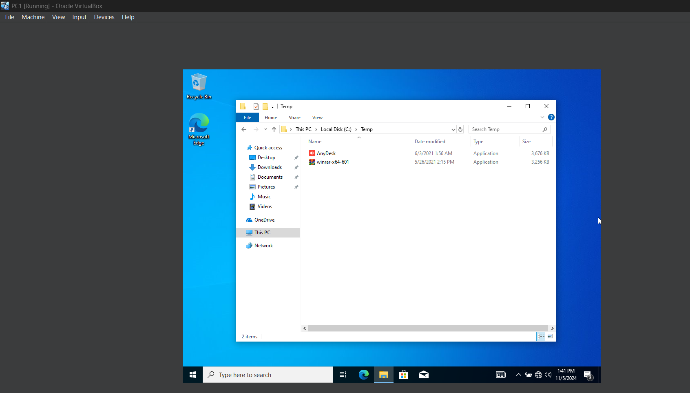
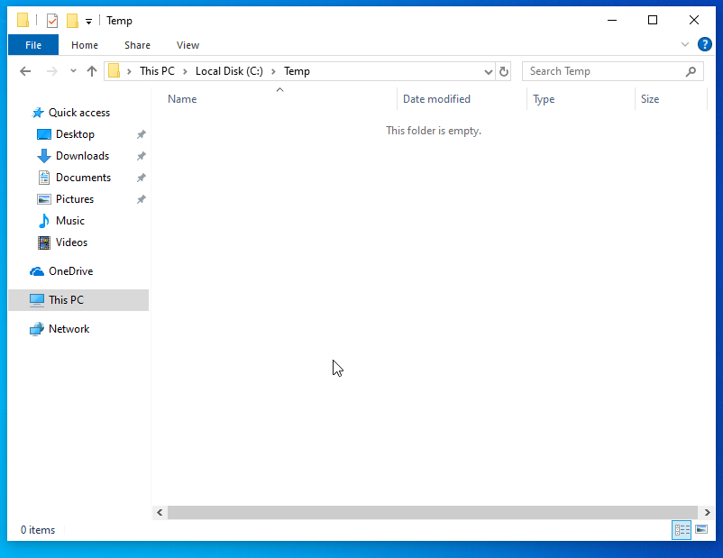
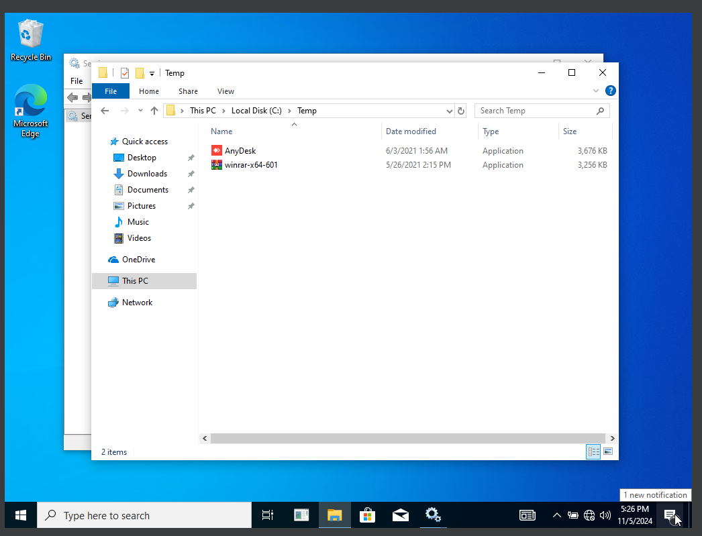
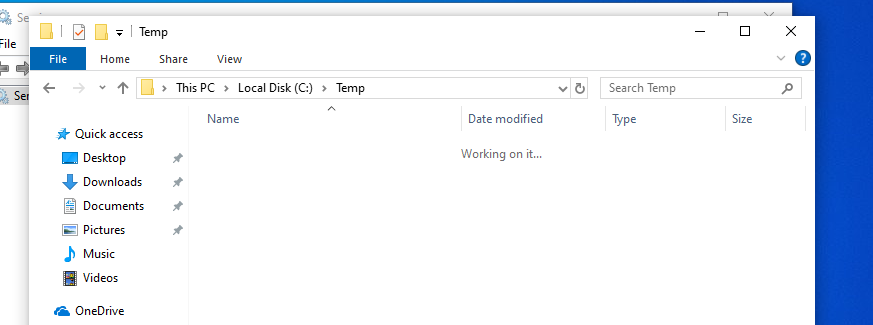

## Overview

This lab sets up a centralised software deployment system across a small AD environment — one Domain Controller and two domain-joined workstations (PC1 and PC2).

The goal is to push WinRAR and AnyDesk from the DC to both machines without touching them manually. The script handles everything: checking if the temp folder exists on the client, copying the installers over the admin share, running them silently, then cleaning up.

### What it does
- Hosts the installers on the DC under `C:\Remote Install\`
- Copies them to `\\hostname\c$\Temp` on each target
- Runs silent installs remotely via `Invoke-Command`
- Deletes the installers from the client after installation

---

## Environment


*DC acts as the deployment hub. PC1 and PC2 are joined to the `rajkumar.local` domain.*

Installers sit on the server at `C:\Remote Install\`:




---

## Automated Deployment Script

The PowerShell script reads target hostnames from a text file, checks for the presence of the deployment folder, copies the installation files, and triggers a remote, silent installation.

```powershell
# central_deployment.ps1
# Read list of target workstations
$HostsList = Get-Content "C:\Remote Install\livepc.txt"

# Installer binaries to deploy
$Folder = "C:\Remote Install\winrar-x64-601.exe", "C:\Remote Install\AnyDesk.exe"

foreach ($Machine in $HostsList) {
    $remotePath = "\\$Machine\c$\Temp"
    $Test = Test-Path -Path $remotePath

    # Check if Temp folder exists on client, if not, create it
    if ($Test -eq $true) {
        Write-Host "Path exists on $Machine. Proceeding with installation."
    } else {
        Write-Host "Path does not exist on $Machine. Creating folder..."
        New-Item -ItemType Directory -Path $remotePath -ErrorAction SilentlyContinue
    }

    # Copy installer packages to client
    Write-Host "Copying files to $remotePath on $Machine..."
    Copy-Item -Path $Folder -Destination $remotePath -Force

    # Trigger remote silent installation and clean up installers
    Write-Host "Starting installation on $Machine..."
    Invoke-Command -ComputerName $Machine -ScriptBlock {
        # Run silent installations
        &cmd.exe /c "C:\Temp\winrar-x64-601.exe /silent"
        &cmd.exe /c "C:\Temp\AnyDesk.exe --install /silent" 

        # Clean up temporary installation binaries
        Remove-Item -Path "C:\Temp\winrar-x64-601.exe", "C:\Temp\AnyDesk.exe" -Force -ErrorAction SilentlyContinue
    } -ErrorAction Continue

    Write-Host "Installation complete on $Machine."
}
```

---

## Deployment Steps

### Step 1: Check target machines

Before running the script, check what state the targets are in:

- **PC1** already has a `C:\Temp` folder
- **PC2** doesn't — the script will create it


*PC1 — Temp folder already exists.*


*PC2 — no Temp folder yet.*

---

### Step 2: Enable WinRM on the targets

WinRM needs to be running on both machines for `Invoke-Command` to work. Run this on each workstation:

```powershell
Enable-PSRemoting -Force
```



*WinRM service started on the workstations.*

---

### Step 3: Run the script

Run the script from the Domain Controller. It connects to each machine, copies the files, installs silently, then removes the installers.

#### PC1


*Files copied, installed silently, and cleaned up on PC1.*

#### PC2


*Temp folder created, files deployed, installed, and cleaned up on PC2.*


*WinRAR and AnyDesk showing in the installed programs list on the target host.*

#### Final check

Open Control Panel on the target hosts and confirm both apps are installed.
