## Lab Objective

Setting up a **DHCP** server to hand out IP addresses automatically on the LAN. Three parts:
1. **DHCP Server Role Installation:** Installing the required binaries on Windows Server.
2. **DHCP Scope Configuration:** Designing the IP address pool, establishing exclusion ranges, setting lease times, and configuring option parameters (Default Gateway, DNS).
3. **Client-Side Verification:** Activating DHCP on a Windows 10 client host and verifying successful IP address leasing.

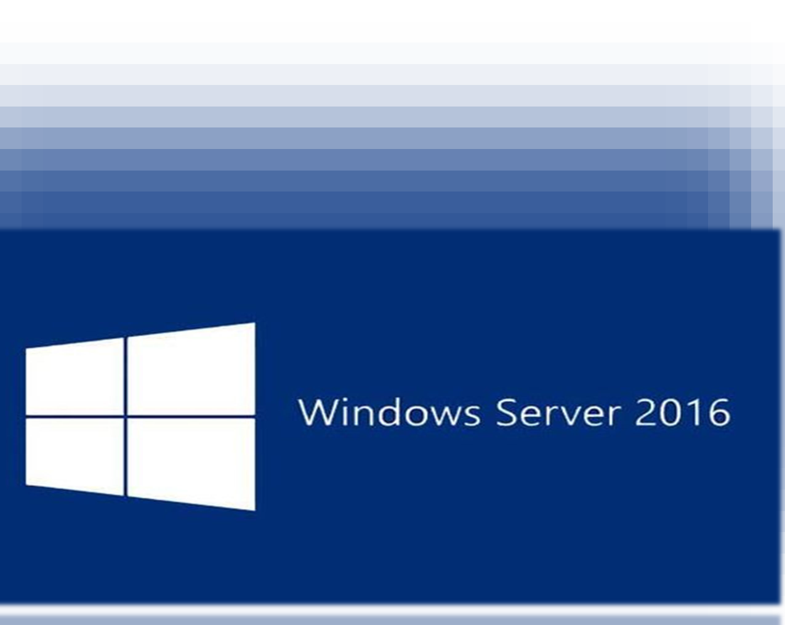

---

## Phase 1: DHCP Server Role Installation

In this phase, we add the **DHCP Server** role to Windows Server using the Server Manager Dashboard.

### Summary of Role Installation Steps

| Step | Action | Description |
| :--- | :--- | :--- |
| **1** | Select Server Role | Select the DHCP Server checkbox in the Add Roles Wizard. |
| **2** | Add Features | Accept the required administration tools and sub-features. |
| **3** | Monitor Installation | Track the progress of the role deployment. |
| **4** | Complete Role Setup | Complete the initial server role installation and launch post-deployment tasks. |
| **5** | Commit Authorization | Authorize the DHCP server in Active Directory to complete credentials delegation. |

---

### Step-by-Step Installation Walkthrough

#### Step 1: Select the DHCP Server Role
Open the **Add Roles and Features Wizard** from Server Manager. Navigate to the **Server Roles** tab and check the box for **DHCP Server**.

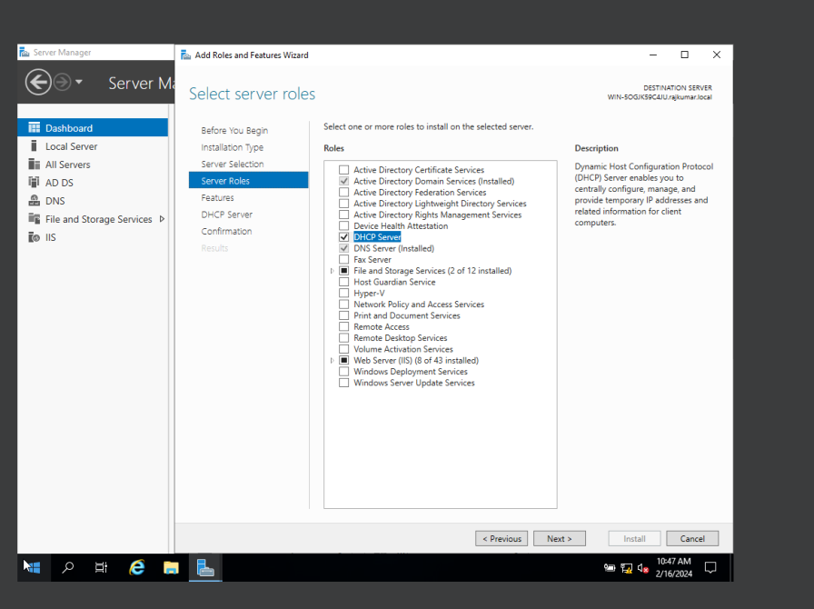

#### Step 2: Confirm Automatic Restart Option
In the confirmation tab, review the selected options. Check **Restart the destination server automatically if required** and click **Install**.

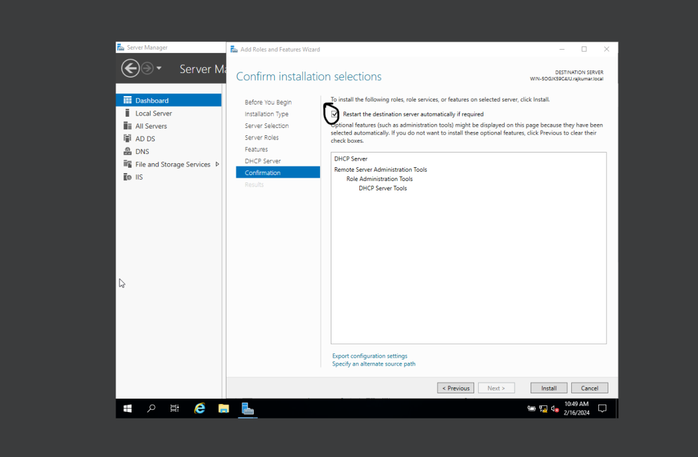

#### Step 3: Monitor Installation Progress
Wait for the installation progress bar to fill. This installs the core DHCP server services.

#### Step 4: Complete Initial Role Setup
Once the installation finishes, click **Close**. In Server Manager, click the warning flag and select **Complete DHCP Configuration** to launch the post-installation wizard.

#### Step 5: Authorize the DHCP Server
In the Post-Install Wizard, authorize the DHCP server using your Domain Administrator credentials. Review the summary showing that security groups have been created and click **Close**.

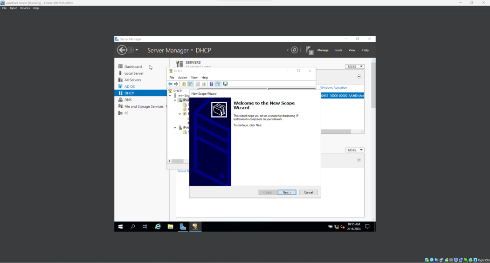

---

## Phase 2: DHCP Scope Configuration

With the role installed, we define the IP address pool and configure scope options (such as DNS and Gateway) to manage dynamic IP allocations.

### Summary of Scope Configuration Steps

| Step | Section | Description |
| :--- | :--- | :--- |
| **6** | Create New Scope | Open the DHCP Management Console and initiate the "New Scope Wizard". |
| **7** | IP Address Range | Define the IP address range pool (Start IP and End IP) and subnet mask. |
| **8** | Add Exclusions | Specify IP ranges within the scope to exclude from dynamic distribution. |
| **9** | Lease Duration | Set the lease lifetime (default is 8 days). |
| **10** | Default Gateway | Add the Router (Default Gateway) IP address for clients. |
| **11** | DNS Settings | Specify the parent domain name and primary/secondary DNS servers. |

---

### Step-by-Step Scope Walkthrough

#### Step 6: Launch the New Scope Wizard
Open the **DHCP console** (via Administrative Tools). Expand the IPv4 node, right-click, and select **New Scope**. Provide a descriptive name for the scope (e.g., `CST170_Scope`).

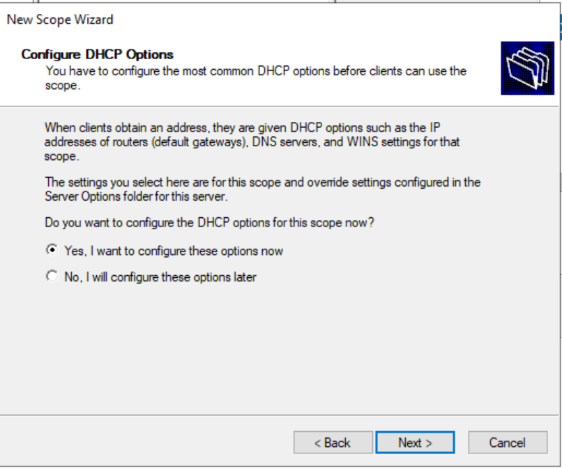

#### Step 7: Define the IP Address Pool
Enter the IP Address Range that the DHCP server will distribute. In this lab, we define a range from `192.168.10.20` to `192.168.10.100` with a standard subnet mask of `/24` (`255.255.255.0`).

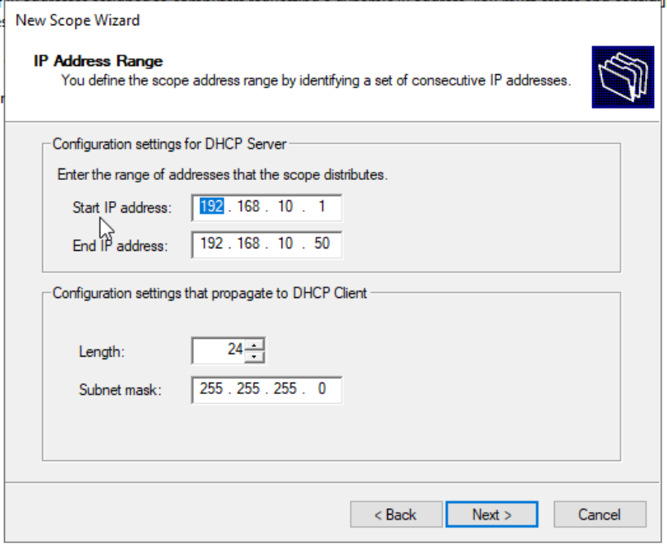

#### Step 8: Configure Exclusions and Delay
Specify any IP addresses within the pool that must not be assigned to client machines (e.g., reserve them for static assignments like printers or switches). Enter the exclusion range and click **Add**.

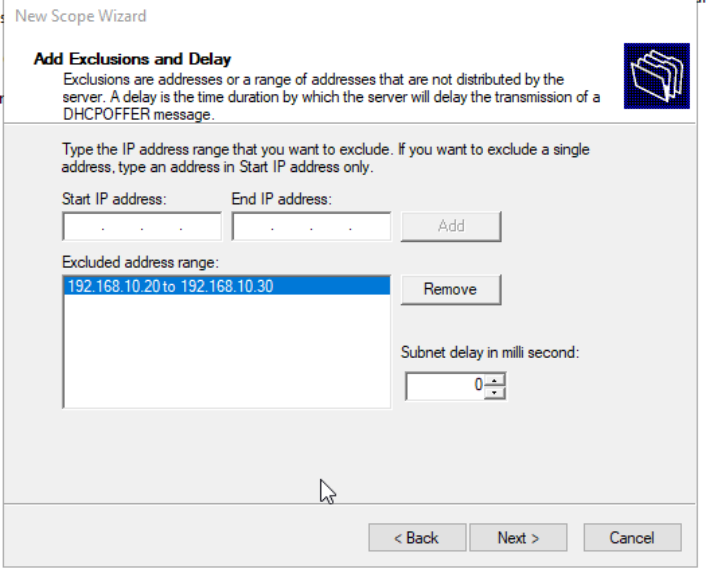

#### Step 9: Configure Lease Duration
Set the lease duration to control how long a client machine keeps its dynamically assigned IP address before requesting a renewal. The default value is set to **8 days**.

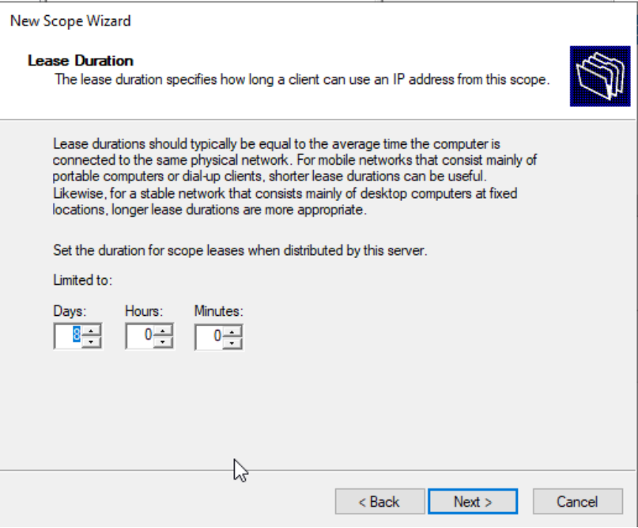

#### Step 10: Configure Router (Default Gateway)
Under **Configure DHCP Options**, select **Yes, I want to configure these options now**. On the Router page, enter the local gateway IP address (e.g., `192.168.10.1`) and click **Add**.

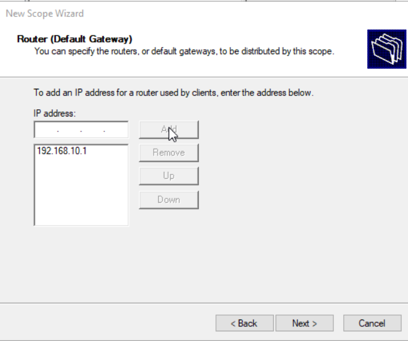

#### Step 11: Configure DNS & Domain Name
Enter the parent domain name (e.g., `rajkumar.local`). Provide the IP addresses of the primary DNS servers (e.g., your local domain controller IP `192.168.10.5` and Google's public DNS `8.8.8.8`) to distribute to clients.

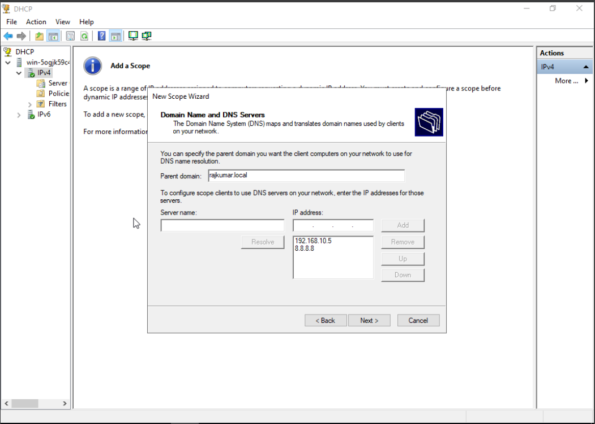
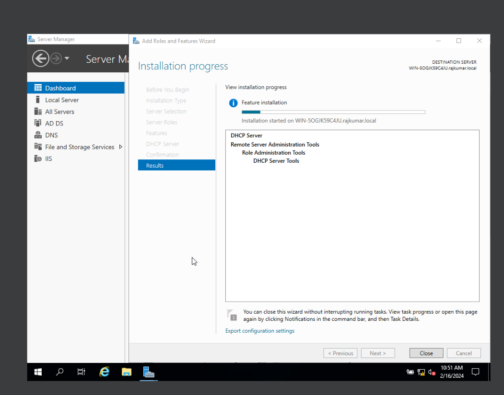

#### Step 12: Activate the Scope
On the final page, select **Yes, I want to activate this scope now** and click **Finish** to bring the scope online.

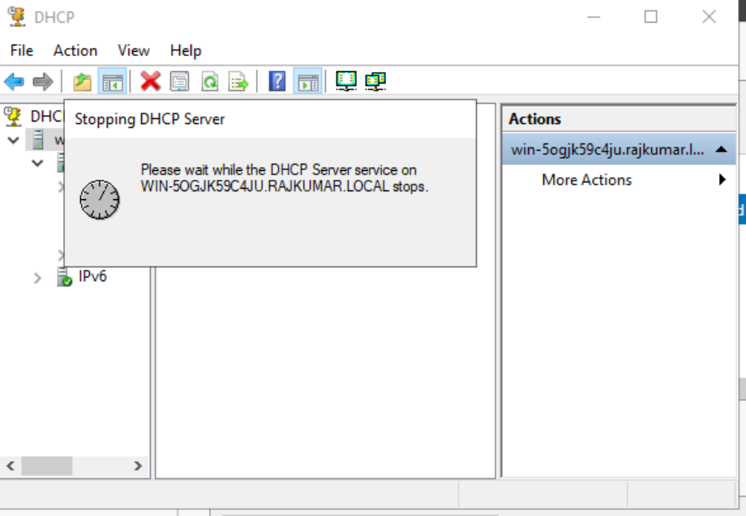

---

## Phase 3: Client-Side DHCP Configuration & Verification

In this final phase, we configure a Windows 10 host to act as a DHCP client and verify that it successfully receives an IP address lease.

### Step 13: Initial Client Check (Static / APIPA State)
Prior to enabling DHCP, the client host has either an auto-configured APIPA address (`169.254.x.x`) or no active connection. Check settings in the network interface properties or run `ipconfig /all`.

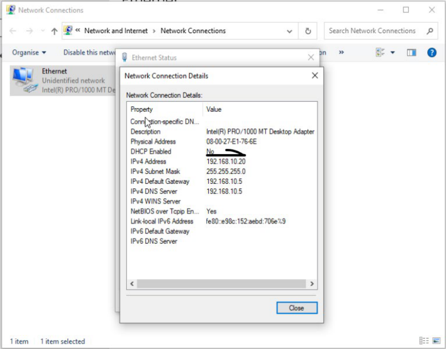

### Step 14: Enable DHCP on the Client Host
Modify the Ethernet adapter properties of the Windows 10 host. Select **Obtain an IP address automatically** and **Obtain DNS server address automatically**, then click **OK**.

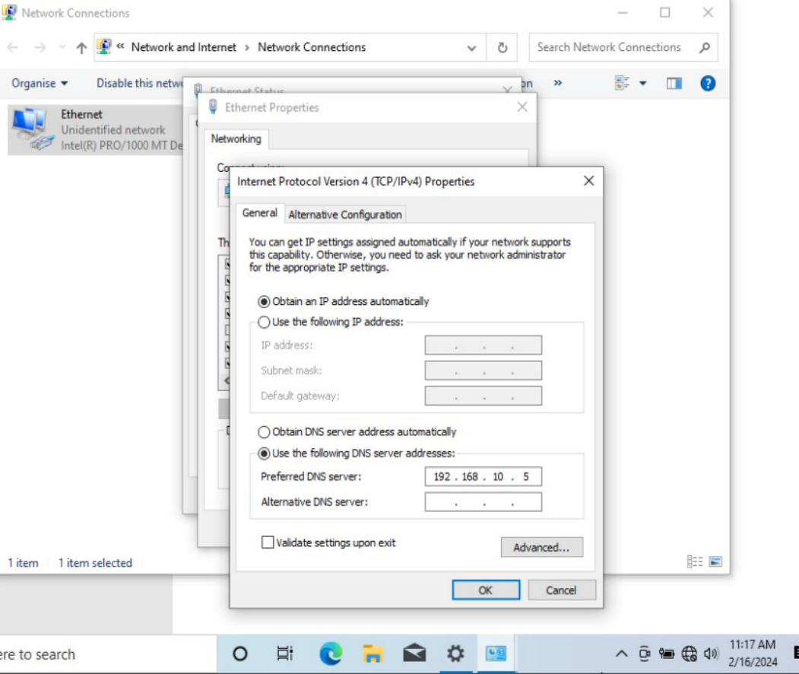

### Step 15: Verify IP Lease Success
Open the Command Prompt on the client host and run `ipconfig /renew` (or `ipconfig /all`). Verify that the host has successfully leased an IP from the pool (e.g., `192.168.10.20`), and that the Default Gateway, DHCP server, and DNS details are populated correctly.

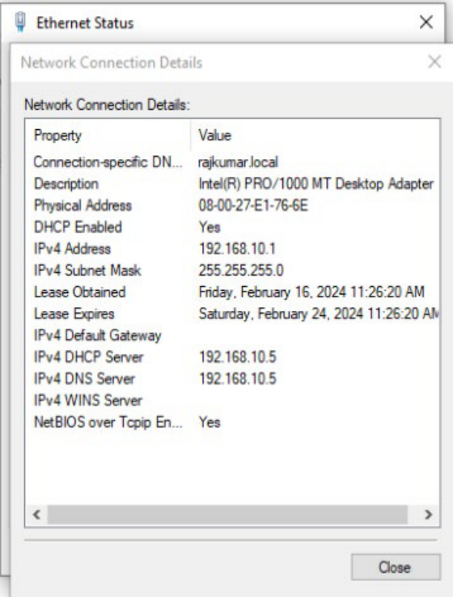
