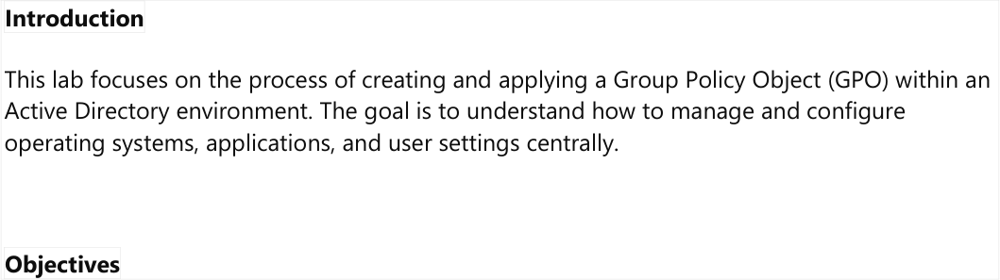
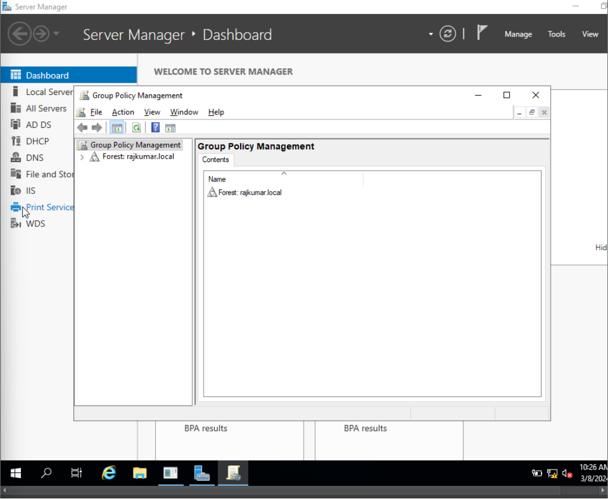
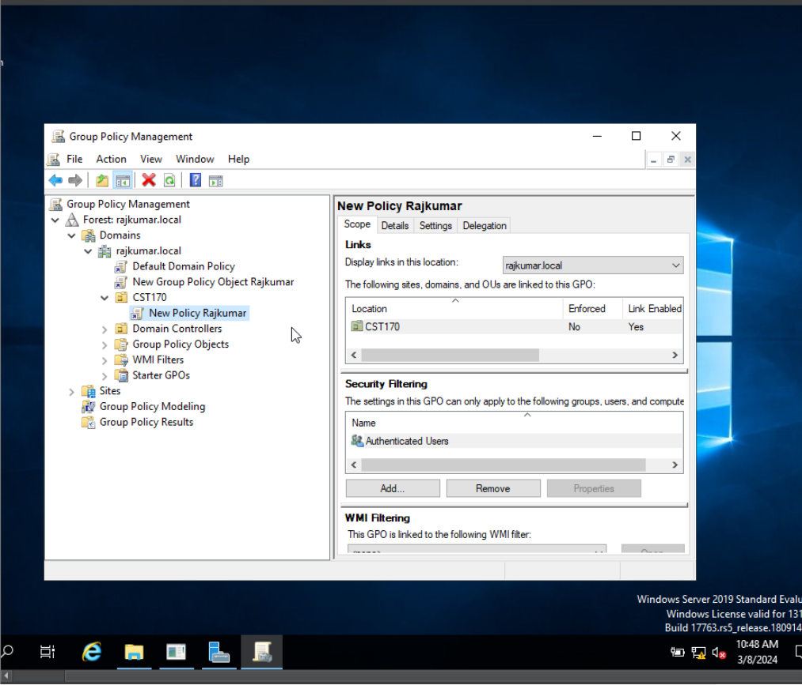
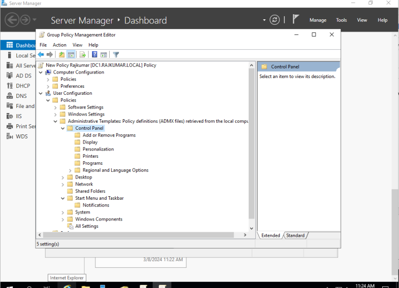
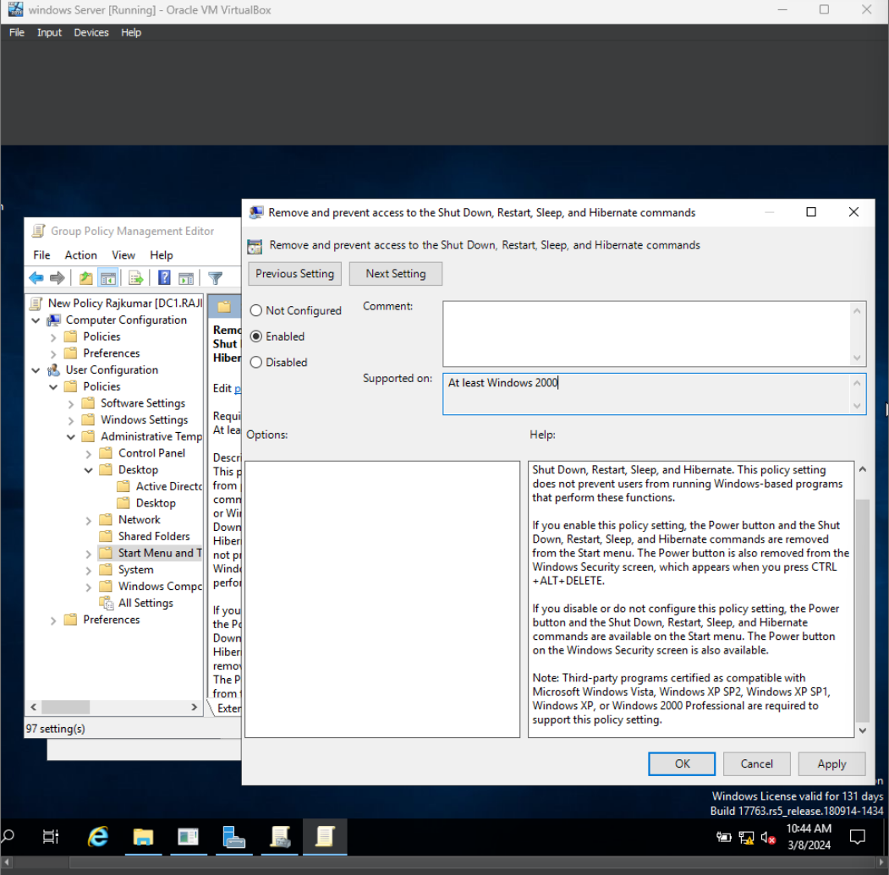
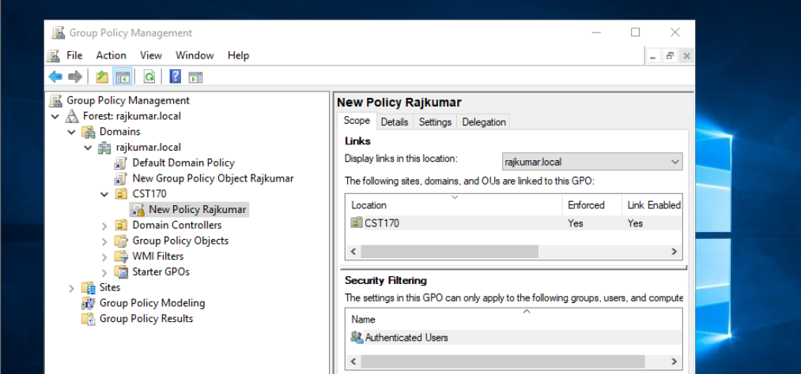
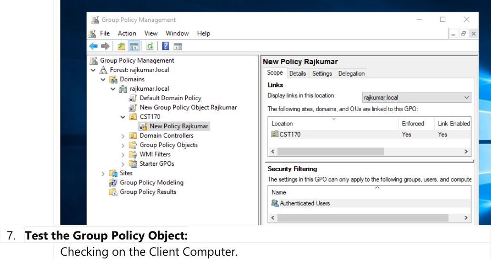
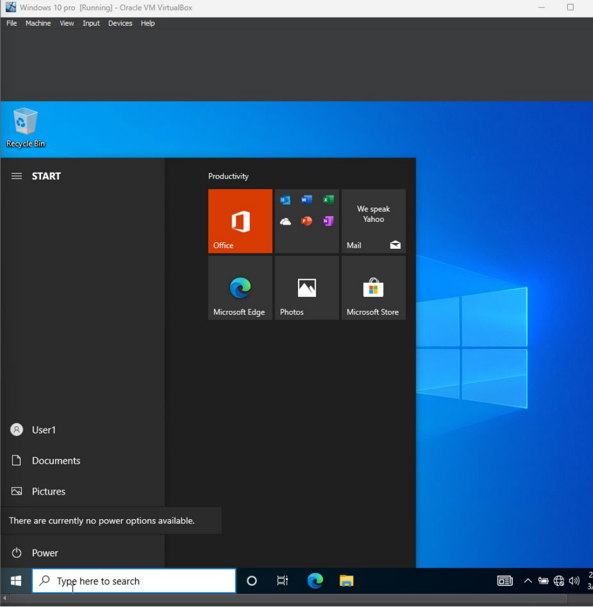

## Conceptual Overview

### 1. What is Group Policy?
**Group Policy** lets you push settings to groups of users or computers from one place in an Active Directory (AD) environment, instead of configuring each machine by hand.

The settings cover a lot of ground: security baselines like password complexity, account lockout policies, and firewall rules, as well as user-facing tweaks like desktop backgrounds, software installs, or blocking access to specific system tools.

### 2. Lab Objective
The objective of this lab is to create and enforce a Group Policy Object (GPO) to restrict specific user actions on client computers.
* **Goal:** Create a GPO, configure user administrative templates to remove system shutdown/restart options, link the GPO to the `CST170` Organizational Unit, and verify the policy enforcement on a client workstation.

---

## Materials & Prerequisites

* **Domain Controller:** Windows Server configured with Active Directory Domain Services (AD DS) and Group Policy Management Console (GPMC) installed.
* **Client Machine:** Windows 10 client host joined to the `rajkumar.local` domain.
* **Target Container:** An active Organizational Unit (OU) (e.g., `CST170`) containing the test user accounts.

---

## Step-by-Step GPO Implementation Walkthrough

### Summary of GPO Procedure

| Step | Action | Description |
| :--- | :--- | :--- |
| **1** | Open GPMC | Launch the Group Policy Management Console in Server Manager. |
| **2** | Locate OU Container | Navigate to the target Organizational Unit (`CST170`). |
| **3** | Create & Link GPO | Create a new GPO ("New Policy Rajkumar") linked directly to the OU. |
| **4** | Open GPO Editor | Open the Group Policy Management Editor for the new GPO. |
| **5** | Configure Settings | Enable the "Remove and prevent access to Shut Down/Restart" administrative template. |
| **6** | Verify Link | Confirm that the GPO link is active and enabled for the OU. |
| **7** | Client Verification | Log in to the client workstation, update policy, and verify the missing options. |

---

### Phase 1: GPO Creation & Linking

#### Step 1: Open Group Policy Management Console (GPMC)
Log in to the Domain Controller. Open **Server Manager**, click on **Tools** in the top-right corner, and select **Group Policy Management** to open the management console.

#### Step 2: Locate the Target Container
Expand the console tree: **Forest: rajkumar.local > Domains > rajkumar.local**. Locate the Organizational Unit where the policy will be applied (e.g., `CST170`).

#### Step 3: Create a GPO and Link It Here
Right-click on the **CST170** OU and select **Create a GPO in this domain, and Link it here...**. In the dialog box, name the GPO (e.g., `New Policy Rajkumar`) and click **OK**.

---

### Phase 2: Policy Settings Configuration

#### Step 4: Open Group Policy Management Editor (GPME)
Right-click the newly created GPO under the `CST170` OU and select **Edit** to open the Group Policy Management Editor.

#### Step 5: Configure the Administrative Template
In the GPME console, navigate to the following path under User Configuration:
`User Configuration > Policies > Administrative Templates > Start Menu and Taskbar`

Locate the setting: **Remove and prevent access to the Shut Down, Restart, Sleep, and Hibernate commands**. Double-click it, change the setting to **Enabled**, and click **OK**.

---

### Phase 3: Enforcing & Testing the Policy

#### Step 6: Verify and Enforce GPO
Go back to the Group Policy Management Console. Ensure that the GPO is linked to the `CST170` OU and its status shows **Link Enabled**. If needed, right-click the link and select **Enforced** to prevent lower-level containers from overriding the setting.

#### Step 7: Test Policy on the Client Workstation
1. Log in to the Windows 10 client host using a domain user account that resides in the `CST170` OU.
2. Open Command Prompt and run `gpupdate /force` to immediately pull the new GPO configurations from the Domain Controller.
3. Open the **Start Menu**, click the **Power** icon, and verify that the power options (*Shut Down, Restart, Sleep, Hibernate*) have been removed, displaying the message *"There are currently no power options available."*

