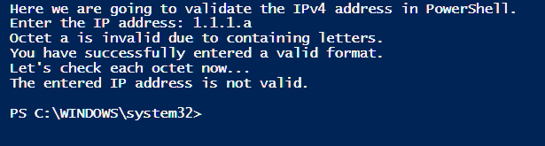
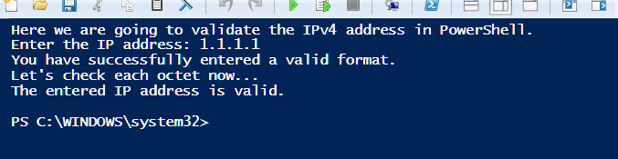
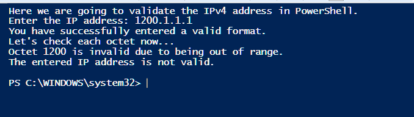
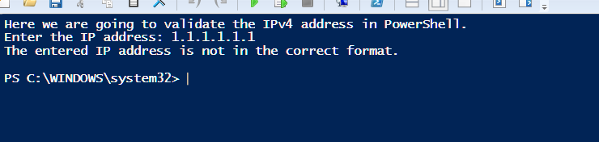

## Overview

A small validation script that checks whether an input string is a valid IPv4 address. It runs three checks in order:

1. The string must have exactly 4 octets separated by dots
2. Each octet must contain only numbers — no letters or special characters
3. Each octet must be between `0` and `255`

---

## Script

Splits the input on `.`, then loops through each octet running a regex check for letters and a range check for numeric bounds.

```powershell
# ip_validator.ps1
# Validate IPv4 addresses with formatting and range checks

Clear-Host
$invalidChars = '[a-zA-Z]'

Write-Host "==========================================" -ForegroundColor Cyan
Write-Host "   PowerShell IPv4 Address Validator"
Write-Host "==========================================" -ForegroundColor Cyan

# Prompt user for IP input
$IP = Read-Host "Enter the IP address"
$octets = $IP -split '\.'
$isValid = $true

# Check if the address has exactly 4 octets
if ($octets.Count -eq 4) {
    $i = 0
    Write-Host "IP has valid 4-octet format. Checking values..." -ForegroundColor Yellow
    Start-Sleep -Seconds 1
    
    do {
        $octet = $octets[$i]
        
        # Check for letters or invalid characters
        if ($octet -match $invalidChars) {
            Write-Host "Validation Error: Octet '$octet' is invalid (contains letters/characters)." -ForegroundColor Red
            $isValid = $false
        } 
        # Check numeric range bounds
        elseif ([int]$octet -ge 0 -and [int]$octet -le 255) {
            Write-Host "Octet [$i]: '$octet' is valid." -ForegroundColor Green
        } 
        # Handle out of bounds
        else {
            Write-Host "Validation Error: Octet '$octet' is out of range (must be 0-255)." -ForegroundColor Red
            $isValid = $false
        }
        $i++
    } while ($i -lt $octets.Length -and $isValid)
    
    # Final validation output
    if ($isValid) {
        Write-Host "`nResult: The entered IP address '$IP' is VALID." -ForegroundColor Green
    } else {
        Write-Host "`nResult: The entered IP address '$IP' is INVALID." -ForegroundColor Red
    }
} else {
    Write-Host "Validation Error: The input '$IP' does not match the 4-octet format (X.X.X.X)." -ForegroundColor Red
}
```

---

## Test Cases

### Letters in an octet



### Valid address



### Octet out of range



### Wrong number of octets


