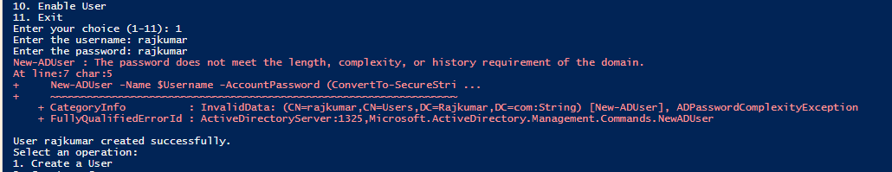
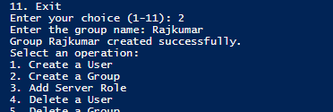

## Overview

This is the extended version of the basic AD admin script. Same menu-driven structure, but covers 10 operations instead of 3 — including deleting accounts and groups, managing group membership, resetting passwords, and toggling account states.

### Operations
1. Create User
2. Create Group
3. Add Server Role
4. Delete User
5. Delete Group
6. Add User to Group
7. List Users in Group
8. Reset User Password
9. Disable User
10. Enable User

---

## Script

Each operation is a separate function. The main loop runs until the user picks 11 (Exit).

```powershell
# directory_admin_advanced.ps1
# Advanced Active Directory Management Suite

Clear-Host

function Create-User {
    param(
        [string]$Username,
        [string]$Password
    )
    $SecurePassword = ConvertTo-SecureString $Password -AsPlainText -Force
    New-ADUser -Name $Username -AccountPassword $SecurePassword -Enabled $true
    Write-Host "User '$Username' created successfully." -ForegroundColor Green
}

function Create-Group {
    param(
        [string]$GroupName
    )
    New-ADGroup -Name $GroupName -GroupScope Global -GroupCategory Security
    Write-Host "Group '$GroupName' created successfully." -ForegroundColor Green
}

function Add-ServerRole {
    param(
        [string]$Role
    )
    Install-WindowsFeature -Name $Role -IncludeManagementTools
    Write-Host "Server role '$Role' installed successfully." -ForegroundColor Green
}

function Delete-User {
    param(
        [string]$Username
    )
    Remove-ADUser -Identity $Username -Confirm:$false
    Write-Host "User '$Username' deleted successfully." -ForegroundColor Green
}

function Delete-Group {
    param(
        [string]$GroupName
    )
    Remove-ADGroup -Identity $GroupName -Confirm:$false
    Write-Host "Group '$GroupName' deleted successfully." -ForegroundColor Green
}

function Add-UserToGroup {
    param(
        [string]$Username,
        [string]$GroupName
    )
    Add-ADGroupMember -Identity $GroupName -Members $Username
    Write-Host "User '$Username' added to group '$GroupName'." -ForegroundColor Green
}

function List-UsersInGroup {
    param(
        [string]$GroupName
    )
    $members = Get-ADGroupMember -Identity $GroupName -Recursive | Where-Object { $_.objectClass -eq 'user' }
    Write-Host "`nUsers in group '$GroupName':" -ForegroundColor Cyan
    $members | ForEach-Object { Write-Host " - $($_.Name)" -ForegroundColor Yellow }
}

function Reset-UserPassword {
    param(
        [string]$Username,
        [string]$NewPassword
    )
    $SecurePassword = ConvertTo-SecureString $NewPassword -AsPlainText -Force
    Set-ADAccountPassword -Identity $Username -Reset -NewPassword $SecurePassword
    Write-Host "Password for user '$Username' has been reset successfully." -ForegroundColor Green
}

function Disable-User {
    param(
        [string]$Username
    )
    Disable-ADAccount -Identity $Username
    Write-Host "User '$Username' has been disabled." -ForegroundColor Yellow
}

function Enable-User {
    param(
        [string]$Username
    )
    Enable-ADAccount -Identity $Username
    Write-Host "User '$Username' has been enabled." -ForegroundColor Green
}

# Main Menu Control Flow
do {
    Write-Host "`n==========================================" -ForegroundColor Cyan
    Write-Host "    Active Directory Management Suite"
    Write-Host "==========================================" -ForegroundColor Cyan
    Write-Host "1. Create a User"
    Write-Host "2. Create a Group"
    Write-Host "3. Add Server Role"
    Write-Host "4. Delete a User"
    Write-Host "5. Delete a Group"
    Write-Host "6. Add User to Group"
    Write-Host "7. List Users in a Group"
    Write-Host "8. Reset User Password"
    Write-Host "9. Disable User"
    Write-Host "10. Enable User"
    Write-Host "11. Exit"
    Write-Host "------------------------------------------" -ForegroundColor Cyan
    
    $choice = Read-Host "Enter your choice (1-11)"
    
    switch ($choice) {
        1 {
            $Username = Read-Host "Enter the username"
            $Password = Read-Host "Enter the password"
            Create-User -Username $Username -Password $Password
        }
        2 {
            $GroupName = Read-Host "Enter the group name"
            Create-Group -GroupName $GroupName
        }
        3 {
            $Role = Read-Host "Enter the server role (e.g., DHCP)"
            Add-ServerRole -Role $Role
        }
        4 {
            $Username = Read-Host "Enter the username to delete"
            Delete-User -Username $Username
        }
        5 {
            $GroupName = Read-Host "Enter the group name to delete"
            Delete-Group -GroupName $GroupName
        }
        6 {
            $Username = Read-Host "Enter the username"
            $GroupName = Read-Host "Enter the group name"
            Add-UserToGroup -Username $Username -GroupName $GroupName
        }
        7 {
            $GroupName = Read-Host "Enter the group name"
            List-UsersInGroup -GroupName $GroupName
        }
        8 {
            $Username = Read-Host "Enter the username"
            $NewPassword = Read-Host "Enter the new password"
            Reset-UserPassword -Username $Username -NewPassword $NewPassword
        }
        9 {
            $Username = Read-Host "Enter the username to disable"
            Disable-User -Username $Username
        }
        10 {
            $Username = Read-Host "Enter the username to enable"
            Enable-User -Username $Username
        }
        11 {
            Write-Host "Exiting directory administration suite..." -ForegroundColor Yellow
            break
        }
        default {
            Write-Host "Invalid choice, please try again." -ForegroundColor Red
        }
    }
} while ($choice -ne 11)
```

---

## Verification

Run the script on the Domain Controller in an elevated session. The menu prints to the console — pick an option and follow the prompts.

### Creating a User


*Output after creating a user account.*

### Creating a Group


*Output after creating a security group.*

---

The other 8 operations work the same way — pick the number, enter what it asks for, and check the coloured output to confirm it worked.
