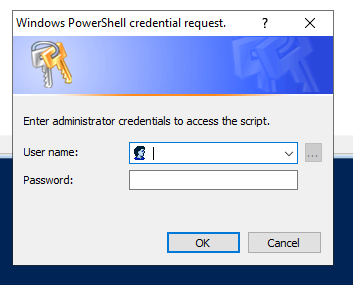
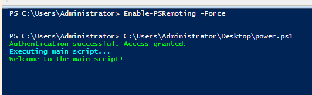
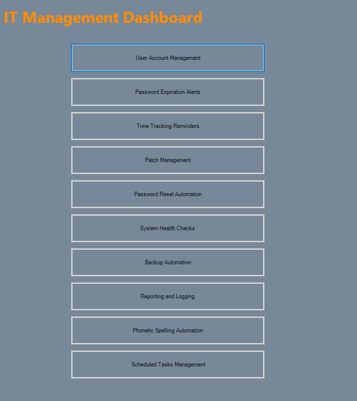
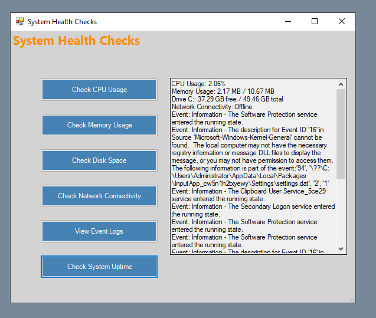
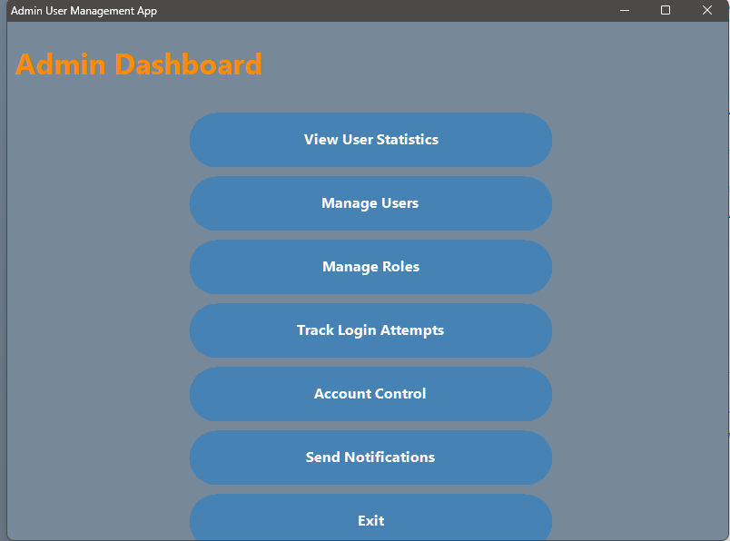
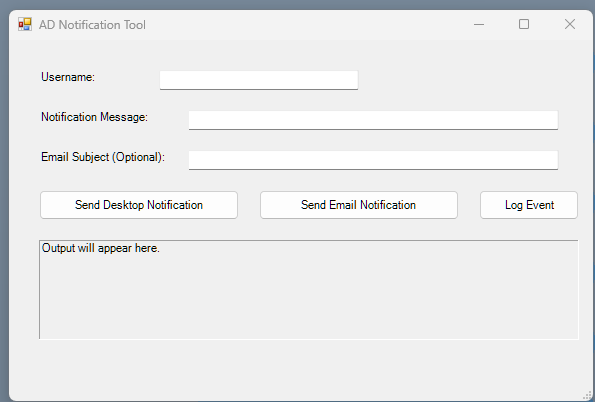

<a href="https://github.com/raiz-toff/POWERSHELL_SCRIPTING/tree/main" class="gh-pill" target="_blank" rel="noopener noreferrer">
  <svg viewBox="0 0 24 24" width="13" height="13" aria-hidden="true">
    <path fill="currentColor" d="M12 .297c-6.63 0-12 5.373-12 12 0 5.303 3.438 9.8 8.205 11.385.6.113.82-.258.82-.577 0-.285-.01-1.04-.015-2.04-3.338.724-4.042-1.61-4.042-1.61C4.422 18.07 3.633 17.7 3.633 17.7c-1.087-.744.084-.729.084-.729 1.205.084 1.838 1.236 1.838 1.236 1.07 1.835 2.809 1.305 3.495.998.108-.776.417-1.305.76-1.605-2.665-.3-5.466-1.332-5.466-5.93 0-1.31.465-2.38 1.235-3.22-.135-.303-.54-1.523.105-3.176 0 0 1.005-.322 3.3 1.23.96-.267 1.98-.399 3-.405 1.02.006 2.04.138 3 .405 2.28-1.552 3.285-1.23 3.285-1.23.645 1.653.24 2.873.12 3.176.765.84 1.23 1.91 1.23 3.22 0 4.61-2.805 5.625-5.475 5.92.42.36.81 1.096.81 2.22 0 1.606-.015 2.896-.015 3.286 0 .315.21.69.825.57C20.565 22.092 24 17.592 24 12.297c0-6.627-5.373-12-12-12"/>
  </svg>
  raiz-toff / POWERSHELL_SCRIPTING
</a>

<style>{`
  .gh-pill {
    display: inline-flex;
    align-items: center;
    gap: 5px;
    margin-bottom: 1.25rem;
    padding: 2px 9px;
    border: 1px solid var(--color-fd-border);
    border-radius: 20px;
    font-size: 11px;
    font-weight: 500;
    color: var(--color-fd-muted-foreground) !important;
    text-decoration: none !important;
    transition: color 0.15s, border-color 0.15s;
  }
  .gh-pill:hover {
    color: var(--color-fd-foreground) !important;
    border-color: color-mix(in oklab, var(--color-fd-primary) 40%, var(--color-fd-border));
  }
  .gh-pill svg { width: 11px; height: 11px; flex-shrink: 0; }
`}</style>

---

## Overview

This is a Windows Forms GUI built in PowerShell — a full IT Management Dashboard that runs on a Domain Controller. It covers 10 admin tasks: AD user management, password expiry alerts, patch auditing, backups, system health checks, scheduled tasks, and more.

Before the dashboard loads, a credential wrapper runs first. It prompts for admin credentials, tests them against a privileged path, and only launches the main GUI if the check passes.

---

## Dashboard Tabs

1. User Account Management — create, enable, disable, search AD accounts
2. Password Expiration Alerts — flag accounts close to expiry
3. Time Tracking Reminders — session usage and alerts
4. Patch Management — query local hotfixes and updates
5. Password Reset — change user passwords securely
6. System Health Checks — live CPU, RAM, disk, and service status
7. Backup Automation — scheduled and on-demand folder backups
8. Reporting & Logging — search and review application logs
9. Phonetic Spelling — convert names/usernames to NATO phonetic alphabet
10. Scheduled Tasks — list, create, and delete local task scheduler entries

---

## Credential Wrapper

The entry point script handles authentication before anything else loads.

1. Prompts for credentials via `Get-Credential`
2. Spawns a background process under those credentials to test a privileged path
3. Catches auth failures and logs them
4. If the exit code is `0`, loads the main dashboard

```powershell
# Key snippet for Secure Credentials Retrieval
$Credentials = Get-Credential -Message "Enter administrator credentials to access the script."

# Key snippet for Verification execution
$Result = Start-Process -FilePath "powershell.exe" -ArgumentList "-Command", $TestCommand -Credential $Credentials -NoNewWindow -Wait -PassThru
```

---

## Screenshots

### Authentication Prompt



### Dashboard

| Component | Screenshot |
| :--- | :--- |
| Main Dashboard |  |
| AD Users & Search |  |
| Stats Console |  |
| Account Controls |  |
| Alerts & Logging |  |

---

## Requirements

- PowerShell 5.1 or later
- Elevated session (Run as Administrator)
- `ActiveDirectory` module installed on the Domain Controller
- Don't hardcode credentials — use `Get-Credential` or a vault

---

## Source Code

The wrapper entry point — handles credential prompting and verification before loading the dashboard:

```powershell
# Verify-AdminCredentials.ps1
# Wrapper logic to secure the IT Management Dashboard
Function Verify-AdminCredentials {
    # Prompt for credentials
    $credentials = Get-Credential -Message "Enter administrator credentials to access the script."
    
    if (-not $credentials) {
        Write-Host "No credentials entered. Exiting script." -ForegroundColor Red
        return
    }

    # Define a test command to validate credentials
    $testCommand = {
        Test-Path "C:\Windows\System32"
    }

    try {
        # Run a test command using the entered credentials
        $result = Start-Process -FilePath "powershell.exe" -ArgumentList "-Command", $testCommand -Credential $credentials -NoNewWindow -Wait -PassThru

        if ($result.ExitCode -eq 0) {
            Write-Host "Authentication successful. Access granted." -ForegroundColor Green
            # Call the external script file main.ps1
            & "C:\Users\Administrator\Desktop\main.ps1"
        } else {
            Write-Host "Authentication failed. Access denied." -ForegroundColor Red
        }
    } catch {
        Write-Host "An error occurred during authentication: $_" -ForegroundColor Red
    }
}

# Call the Verify-AdminCredentials function
Verify-AdminCredentials
```

To browse, clone, or download the full dashboard (5,600+ lines):

<LinkButton href="https://github.com/raiz-toff/POWERSHELL_SCRIPTING/tree/main" icon="github" iconPlacement="start">
  Check the repo
</LinkButton>
