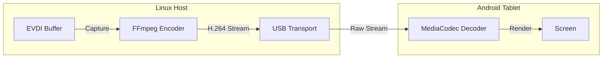

> **Turn your Android tablet into a secondary display for Linux via USB.**
> *Like SuperDisplay or Duet Display, but open source and built natively for Linux.*

I wanted a way to extend my Linux desktop workspace using the high-quality screen of my Android tablet, but existing solutions like VNC were too laggy, and commercial options like SuperDisplay didn't support Linux native USB connections reliably. So, I built my own solution using **EVDI** (the same technology behind DisplayLink) and low-latency USB streaming.

## Key Features

*   **Low Latency**: ~20-40ms glass-to-glass over USB Type-C.
*   **High Resolution**: Supports resolutions up to 4K at 120Hz.
*   **Plug & Play**: Uses ADB/USB for a reliable, wired connection—no WiFi lag.
*   **Hardware Acceleration**: Encodes on the GPU (NVENC/VAAPI/QSV), so host CPU usage stays low.
*   **Native Linux Integration**: Uses the EVDI kernel module to create a genuine monitor interface in your OS (GNOME/KDE sees it as a real connected display).

## How It Works

The system consists of two main components: a C++ host service on Linux and a Kotlin client app on Android.

### Application Architecture

1.  **Screen Capture (EVDI)**: The host creates a virtual framebuffer using the EVDI kernel driver. Linux desktop environments treat this as a standard physical monitor.
2.  **Encoding (FFmpeg)**: The pixel data from EVDI is captured and encoded into a H.264/HEVC stream using hardware-accelerated encoders (NVENC/VAAPI).
3.  **Transport (ADB/USB)**: The encoded stream is sent over a raw USB socket connection established via ADB port forwarding.
4.  **Decoding (Android)**: The Android app uses the native `MediaCodec` API to decode the video stream directly to a SurfaceView with minimal buffering.

## Performance Metrics

| Metric | Result |
| :--- | :--- |
| **Capture FPS** | 50+ FPS |
| **Encoding Latency** | ~7ms (NVENC) |
| **Transport Latency** | ~1-3ms (USB) |
| **Tested Resolution** | Up to 2960x1820 |

## Project Structure

The project is organized into two distinct codebases:

*   **`libvirtualdisplay/`**: The Linux host library written in **C++17**. It handles the interaction with the EVDI kernel module, manages the FFmpeg encoding pipeline, and handles the USB socket communication.
*   **`android-client/`**: The viewer application written in **Kotlin**. It handles device discovery, stream negotiation, and efficient hardware decoding.

## Roadmap

*   [x] **Phase 1**: Core EVDI Integration & Framebuffer capture.
*   [x] **Phase 2**: Hardware Accelerated Encoding (NVENC/VAAPI).
*   [x] **Phase 3**: Stable USB Transport protocol.
*   [ ] **Phase 4**: Reverse Input Injection (using the tablet touchscreen to control the mouse).
*   [ ] **Phase 5**: Audio tunneling (send PC audio to tablet speakers).

---

*This project is currently in active development. You can follow the progress or contribute on [GitHub](https://github.com/raiz-toff/Virtual-Display).*

